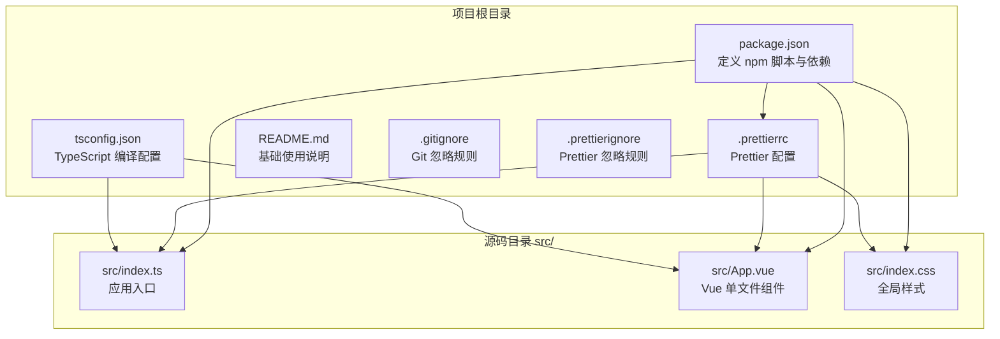
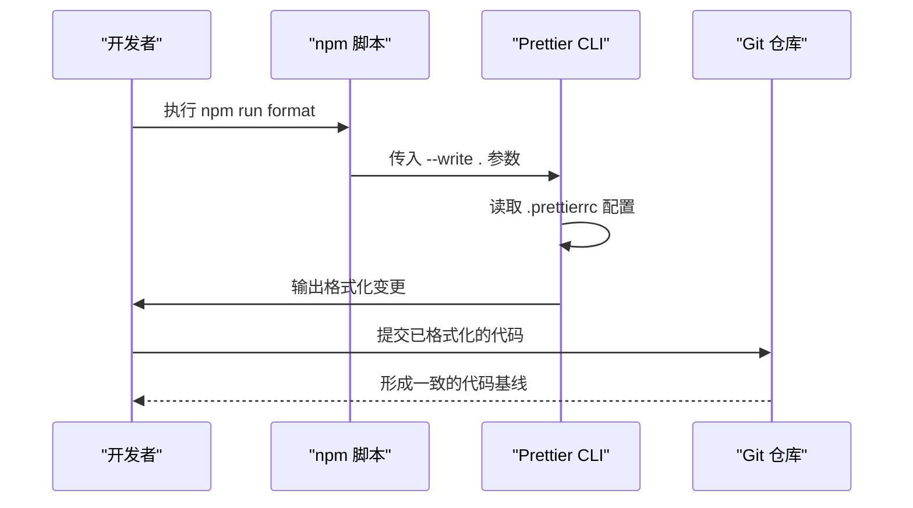
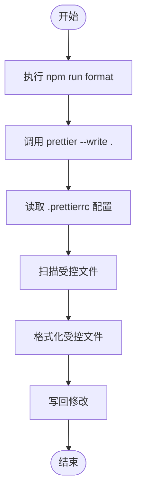
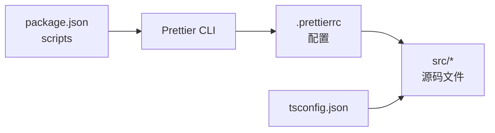

# 代码质量工具

<cite>
**本文引用的文件**
- [.prettierrc](file://.prettierrc)
- [package.json](file://package.json)
- [AGENTS.md](file://AGENTS.md)
- [src/index.ts](file://src/index.ts)
- [src/App.vue](file://src/App.vue)
- [src/index.css](file://src/index.css)
</cite>

## 目录
1. [简介](#简介)
2. [项目结构](#项目结构)
3. [核心组件](#核心组件)
4. [架构总览](#架构总览)
5. [详细组件分析](#详细组件分析)
6. [依赖关系分析](#依赖关系分析)
7. [性能考量](#性能考量)
8. [故障排查指南](#故障排查指南)
9. [结论](#结论)
10. [附录](#附录)

## 简介
本文件系统性介绍项目中集成的代码质量保障体系，重点围绕 Prettier 工具的配置与使用展开。基于仓库中的 .prettierrc 配置文件，我们将深入解析：
- 格式化器（formatter）的缩进风格与单引号设置
- Prettier 的覆盖规则（overrides）在不同文件类型中的应用
- npm 脚本 npm run format 的执行流程
- 这些配置如何提升团队代码一致性与可维护性
- 面向开发者的 Prettier 规则自定义指南（含 JavaScript、CSS、Vue 扩展建议）
- 实际代码修改前后对比示例（以路径形式呈现，展示 Prettier 自动修复效果）
- 在 CI/CD 流程中的潜在集成方式

## 项目结构
该项目采用前端工程化方案，结合 Rsbuild 构建工具与 Vue 技术栈。代码质量保障由 Prettier 统一管理，通过 npm scripts 提供统一入口，配合 .prettierignore 忽略规则确保团队协作时的一致性。

图表来源
- [package.json](file://package.json#L1-L25)
- [.prettierrc](file://.prettierrc#L1-L76)
- [tsconfig.json](file://tsconfig.json#L1-L27)
- [src/index.ts](file://src/index.ts#L1-L6)
- [src/App.vue](file://src/App.vue#L1-L29)
- [src/index.css](file://src/index.css#L1-L7)

章节来源
- [package.json](file://package.json#L1-L25)
- [.prettierrc](file://.prettierrc#L1-L76)
- [tsconfig.json](file://tsconfig.json#L1-L27)
- [README.md](file://README.md#L1-L37)

## 核心组件
本节从配置层面梳理 Prettier 的核心能力及其在项目中的落地方式。

- 格式化器（formatter）
  - 缩进风格：使用 2 个空格缩进，禁用 Tab
  - JavaScript 字符串引号：统一使用单引号
  - 分号策略：禁用分号
  - 行尾逗号：使用 ES5 风格
  - 换行符：使用 LF
  - 打印宽度：150 字符
- 覆盖规则（overrides）
  - Vue 文件：使用 vue 解析器，忽略 HTML 空白敏感性
  - TypeScript/JavaScript 文件：使用 typescript 解析器
  - CSS/SCSS/LESS 文件：使用 css 解析器，禁用单引号
  - JSON 文件：使用 json 解析器，2 空格缩进
  - Markdown 文件：使用 markdown 解析器，80 打印宽度
  - HTML 文件：使用 html 解析器，忽略空白敏感性
  - YAML 文件：使用 yaml 解析器，2 空格缩进

章节来源
- [.prettierrc](file://.prettierrc#L1-L76)

## 架构总览
下图展示了 Prettier 在项目中的工作流：开发者通过 npm 脚本触发 Prettier 格式化；Prettier 基于 .prettierrc 的配置对项目根目录下所有文件进行扫描与修复；最终提交到 Git 仓库，形成一致的代码基线。

图表来源
- [package.json](file://package.json#L9-L10)
- [.prettierrc](file://.prettierrc#L1-L76)

## 详细组件分析

### Prettier 配置详解
- semi: false
  - 说明：禁用分号，符合现代 JavaScript 风格
- singleQuote: true
  - 说明：统一使用单引号，减少字符串引号不一致带来的差异
- quoteProps: "as-needed"
  - 说明：仅在必要时引用对象属性名
- trailingComma: "es5"
  - 说明：在 ES5 兼容的环境中添加行尾逗号
- bracketSpacing: true
  - 说明：在对象字面量的括号内添加空格
- arrowParens: "always"
  - 说明：箭头函数参数始终使用括号
- printWidth: 150
  - 说明：每行最大字符数为 150，适应宽屏开发环境
- tabWidth: 2
  - 说明：缩进宽度为 2 个空格
- useTabs: false
  - 说明：禁用 Tab，统一使用空格缩进
- overrides
  - 作用：为不同文件类型提供特定的格式化规则
  - 生效范围：根据文件扩展名匹配并应用相应规则
  - 示例：Vue 文件使用 vue 解析器，CSS 文件禁用单引号

章节来源
- [.prettierrc](file://.prettierrc#L1-L76)

### npm 脚本与执行流程
- npm run format
  - 命令：prettier --write .
  - 行为：对项目根目录下所有受支持的文件进行格式化，写回修改，确保风格一致
- 其他脚本
  - build、dev、preview：由 Rsbuild 提供，与 Prettier 并行存在，分别用于构建、开发与预览

图表来源
- [package.json](file://package.json#L9-L10)
- [.prettierrc](file://.prettierrc#L1-L76)

章节来源
- [package.json](file://package.json#L9-L10)

### 代码示例与自动修复效果（路径指引）
以下示例以"路径+行号"的形式给出，帮助你在本地快速定位并验证 Prettier 的自动修复效果：
- JavaScript 字符串引号修复
  - 参考路径：[src/index.ts](file://src/index.ts#L1-L6)
  - 说明：当存在双引号包裹的字符串时，Prettier 将自动转换为单引号
- 分号移除
  - 参考路径：[src/index.ts](file://src/index.ts#L1-L6)
  - 说明：Prettier 将自动移除语句末尾的分号
- 缩进风格
  - 参考路径：[src/App.vue](file://src/App.vue#L1-L29)、[src/index.css](file://src/index.css#L1-L7)
  - 说明：统一使用 2 个空格缩进，避免 Tab 与空格混用导致的差异
- Vue 文件特殊处理
  - 参考路径：[src/App.vue](file://src/App.vue#L1-L29)
  - 说明：由于覆盖规则设置了 htmlWhitespaceSensitivity: "ignore"，Prettier 将忽略 Vue 模板中的空白敏感性

章节来源
- [.prettierrc](file://.prettierrc#L1-L76)
- [src/index.ts](file://src/index.ts#L1-L6)
- [src/App.vue](file://src/App.vue#L1-L29)
- [src/index.css](file://src/index.css#L1-L7)

### 规则自定义指南（面向开发者）
以下为针对不同文件类型的扩展建议，帮助你进一步细化团队规范。请在 .prettierrc 中修改或新增对应字段以生效：
- JavaScript 扩展
  - 缩进宽度：修改 tabWidth 字段，例如设置为 4
  - 分号策略：修改 semi 字段，选择 true 或 false
  - 导入排序：Prettier 本身不处理导入排序，可结合 ESLint 或其他工具实现
- CSS 扩展
  - 选择器命名：Prettier 不检查 CSS 语义，可通过 CSS Lint 工具补充
  - 样式分组：通过调整 printWidth 和其他格式化选项提升可读性
- Vue 单文件组件
  - 保持 overrides 中的 vue 解析器配置
  - 可调整 htmlWhitespaceSensitivity 以控制模板空白处理
- TypeScript 扩展
  - 保持 overrides 中的 typescript 解析器配置
  - 可结合 TypeScript 的严格模式与 Prettier 的格式化规则

注意：以上为配置建议，具体字段名称与可用值以 Prettier 官方文档为准。请在本地验证后再提交到版本控制。

章节来源
- [.prettierrc](file://.prettierrc#L1-L76)

### CI/CD 集成建议
- 触发时机
  - PR/MR 合并请求：在合并前运行 npm run format，确保代码风格达标
  - 主分支保护：在主分支上强制执行检查，阻止不符合规范的提交
- 失败处理
  - 若格式化失败，应在流水线中输出详细报告，提示开发者修复
  - 可在流水线中加入自动格式化步骤后再次检查
- 缓存与性能
  - 使用缓存加速依赖安装（如 npm ci）
  - 将 Prettier 的缓存目录纳入缓存策略，减少重复扫描时间

[本节为通用实践建议，不直接分析具体文件，故无章节来源]

## 依赖关系分析
- npm 脚本与 Prettier 的耦合
  - package.json 中的 format 脚本直接调用 Prettier CLI，并通过 --write 写回修改
- Prettier 配置与源码的关系
  - .prettierrc 控制格式化行为，影响项目中所有受支持的文件类型
- TypeScript 配置的协同
  - tsconfig.json 提供编译与类型检查基础，与 Prettier 的格式化功能协同工作，共同提升代码质量

图表来源
- [package.json](file://package.json#L9-L10)
- [.prettierrc](file://.prettierrc#L1-L76)
- [tsconfig.json](file://tsconfig.json#L1-L27)

章节来源
- [package.json](file://package.json#L9-L10)
- [.prettierrc](file://.prettierrc#L1-L76)
- [tsconfig.json](file://tsconfig.json#L1-L27)

## 性能考量
- 增量格式化
  - 在开发环境中，可配置编辑器插件仅对保存的文件进行格式化，减少全量扫描开销
- 缓存策略
  - 合理配置 .prettierignore 和 .gitignore，避免对大型生成文件或日志文件执行格式化
- 并行化
  - 在 CI 环境中，可将格式化与其他构建任务拆分为并行任务，缩短流水线时间

[本节提供一般性指导，不直接分析具体文件，故无章节来源]

## 故障排查指南
- 格式化未生效
  - 确认 .prettierrc 是否被正确加载（$schema 字段指向有效路径）
  - 确认 npm run format 是否正常执行
- 格式化冲突
  - 若编辑器与 Prettier 的格式化策略冲突，优先以 Prettier 的配置为准，并在编辑器中同步调整
- 忽略文件问题
  - 检查 .prettierignore 是否正确，确认不需要格式化的文件已被正确排除
- 类型与格式化不一致
  - 结合 tsconfig.json 的严格模式与 Prettier 的格式化规则，逐步消除类型与风格问题

章节来源
- [.prettierrc](file://.prettierrc#L1-L76)
- [package.json](file://package.json#L9-L10)
- [AGENTS.md](file://AGENTS.md#L1-L21)

## 结论
通过在项目中引入 Prettier 并结合 npm 脚本与 .prettierignore 配置，团队能够在开发阶段即统一代码风格，显著提升代码一致性与可维护性。建议在团队内推广该配置，并根据业务场景持续优化规则集与扩展项，以达到更高的质量标准。

[本节为总结性内容，不直接分析具体文件，故无章节来源]

## 附录
- 快速参考
  - 启动开发：npm run dev
  - 构建产物：npm run build
  - 预览生产：npm run preview
  - 格式化代码：npm run format
- 相关文件
  - .prettierrc：Prettier 配置中心
  - package.json：脚本与依赖声明
  - tsconfig.json：TypeScript 编译配置
  - AGENTS.md：开发指南

章节来源
- [package.json](file://package.json#L1-L25)
- [AGENTS.md](file://AGENTS.md#L1-L21)