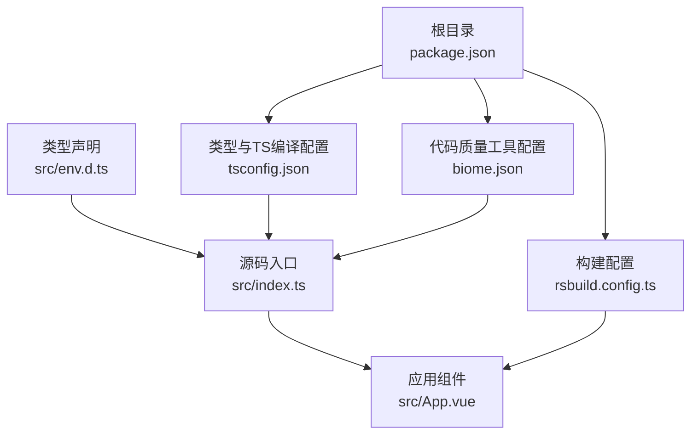
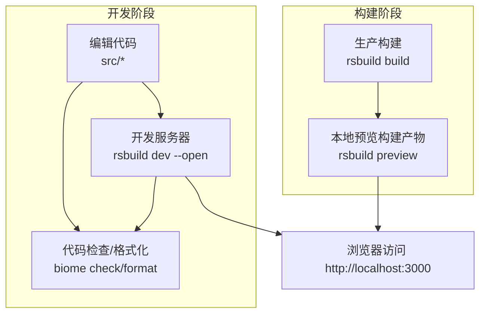
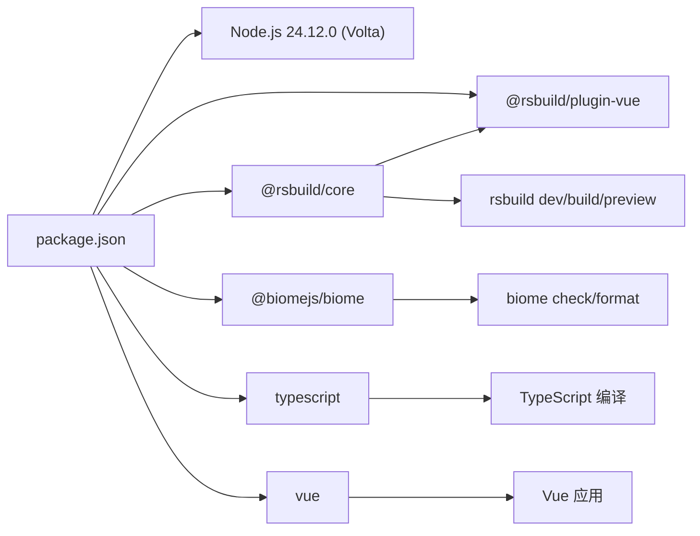

# 开发环境设置

<cite>
**本文引用的文件**
- [package.json](file://package.json)
- [README.md](file://README.md)
- [rsbuild.config.ts](file://rsbuild.config.ts)
- [biome.json](file://biome.json)
- [tsconfig.json](file://tsconfig.json)
- [src/index.ts](file://src/index.ts)
- [src/App.vue](file://src/App.vue)
- [src/env.d.ts](file://src/env.d.ts)
</cite>

## 目录
1. [简介](#简介)
2. [项目结构](#项目结构)
3. [核心组件](#核心组件)
4. [架构总览](#架构总览)
5. [详细组件分析](#详细组件分析)
6. [依赖关系分析](#依赖关系分析)
7. [性能与效率建议](#性能与效率建议)
8. [故障排查指南](#故障排查指南)
9. [结论](#结论)
10. [附录](#附录)

## 简介
本指南面向首次接触 xiuxian 项目的开发者，帮助你从零开始完成开发环境搭建与日常开发工作流。基于仓库中的 npm scripts 与配置文件，我们将系统讲解以下内容：
- 安装依赖：npm install 的作用与注意事项
- 启动开发服务器：npm run dev 的完整流程与浏览器自动打开机制
- 每个 npm 脚本的功能与使用场景：dev、build、preview、check、format
- 环境要求：Node.js 版本通过 Volta 锁定为 24.12.0 的必要性
- 跨平台注意事项：Windows/macOS/Linux 的差异与建议
- 常见问题排查：端口占用、依赖安装失败、格式化与检查工具问题等

## 项目结构
该项目采用 Rsbuild + Vue 的前端工程化结构，核心文件分布如下：
- 根目录配置：package.json、rsbuild.config.ts、biome.json、tsconfig.json
- 源码入口：src/index.ts、src/App.vue、src/env.d.ts
- 文档与说明：README.md

图表来源
- [package.json](file://package.json#L1-L26)
- [rsbuild.config.ts](file://rsbuild.config.ts#L1-L8)
- [tsconfig.json](file://tsconfig.json#L1-L27)
- [biome.json](file://biome.json#L1-L35)
- [src/index.ts](file://src/index.ts#L1-L6)
- [src/App.vue](file://src/App.vue#L1-L29)
- [src/env.d.ts](file://src/env.d.ts#L1-L10)

章节来源
- [package.json](file://package.json#L1-L26)
- [rsbuild.config.ts](file://rsbuild.config.ts#L1-L8)
- [tsconfig.json](file://tsconfig.json#L1-L27)
- [biome.json](file://biome.json#L1-L35)
- [src/index.ts](file://src/index.ts#L1-L6)
- [src/App.vue](file://src/App.vue#L1-L29)
- [src/env.d.ts](file://src/env.d.ts#L1-L10)

## 核心组件
- 构建与开发服务器：Rsbuild 提供 dev/build/preview 能力，并通过插件支持 Vue 单文件组件
- 代码质量与格式化：Biome 提供检查与格式化能力，配合 VCS 集成
- 类型与编译：TypeScript 提供严格类型检查与模块解析策略
- 应用入口与组件：Vue 应用通过入口文件挂载到 DOM

章节来源
- [package.json](file://package.json#L1-L26)
- [rsbuild.config.ts](file://rsbuild.config.ts#L1-L8)
- [biome.json](file://biome.json#L1-L35)
- [tsconfig.json](file://tsconfig.json#L1-L27)
- [src/index.ts](file://src/index.ts#L1-L6)
- [src/App.vue](file://src/App.vue#L1-L29)

## 架构总览
下图展示了从开发到生产的典型流程，以及各工具在其中的角色。

图表来源
- [package.json](file://package.json#L6-L12)
- [rsbuild.config.ts](file://rsbuild.config.ts#L1-L8)
- [biome.json](file://biome.json#L1-L35)

章节来源
- [package.json](file://package.json#L6-L12)
- [rsbuild.config.ts](file://rsbuild.config.ts#L1-L8)
- [biome.json](file://biome.json#L1-L35)

## 详细组件分析

### npm 脚本详解与使用场景
- dev：启动开发服务器并自动打开浏览器
  - 功能要点：调用 rsbuild dev 并传入 --open 参数，自动打开默认浏览器访问本地开发地址
  - 使用场景：日常开发调试、热更新体验
  - 参考路径：[package.json](file://package.json#L6-L12)
- build：生产构建
  - 功能要点：调用 rsbuild build 生成优化后的静态资源
  - 使用场景：打包发布前的最终产物生成
  - 参考路径：[package.json](file://package.json#L6-L12)
- preview：本地预览生产构建
  - 功能要点：启动一个轻量级服务器预览 build 生成的产物
  - 使用场景：验证构建结果是否符合预期
  - 参考路径：[package.json](file://package.json#L6-L12)
- check：代码检查并自动修复可写入项
  - 功能要点：调用 biome check --write 执行 Lint 规则与自动修复
  - 使用场景：提交前统一代码风格与潜在问题修复
  - 参考路径：[package.json](file://package.json#L6-L12)
- format：代码格式化
  - 功能要点：调用 biome format --write 对代码进行格式化
  - 使用场景：快速统一代码风格
  - 参考路径：[package.json](file://package.json#L6-L12)

章节来源
- [package.json](file://package.json#L6-L12)

### Rsbuild 配置与 Vue 插件
- 配置文件：rsbuild.config.ts
  - 功能：启用 @rsbuild/plugin-vue 支持 Vue 单文件组件
  - 参考路径：[rsbuild.config.ts](file://rsbuild.config.ts#L1-L8)
- 应用入口：src/index.ts
  - 功能：创建 Vue 应用并将根组件挂载到 #root
  - 参考路径：[src/index.ts](file://src/index.ts#L1-L6)
- 组件示例：src/App.vue
  - 功能：基础页面结构与样式
  - 参考路径：[src/App.vue](file://src/App.vue#L1-L29)

章节来源
- [rsbuild.config.ts](file://rsbuild.config.ts#L1-L8)
- [src/index.ts](file://src/index.ts#L1-L6)
- [src/App.vue](file://src/App.vue#L1-L29)

### Biome 代码质量配置
- 配置要点：启用 VCS 集成、格式化规则、Linter 推荐规则
- 与脚本联动：check 与 format 脚本直接调用 Biome CLI
- 参考路径：
  - [biome.json](file://biome.json#L1-L35)
  - [package.json](file://package.json#L6-L12)

章节来源
- [biome.json](file://biome.json#L1-L35)
- [package.json](file://package.json#L6-L12)

### TypeScript 编译与类型声明
- 编译选项：严格模式、ESNext 模块解析、JSX 导入源等
- 类型声明：为 .vue 文件提供类型支持
- 参考路径：
  - [tsconfig.json](file://tsconfig.json#L1-L27)
  - [src/env.d.ts](file://src/env.d.ts#L1-L10)

章节来源
- [tsconfig.json](file://tsconfig.json#L1-L27)
- [src/env.d.ts](file://src/env.d.ts#L1-L10)

### 浏览器自动打开机制
- 关键点：dev 脚本中使用 rsbuild dev --open，该参数会自动打开默认浏览器
- 访问地址：开发服务器默认监听本地端口，README 中给出示例地址
- 参考路径：
  - [package.json](file://package.json#L6-L12)
  - [README.md](file://README.md#L11-L17)

章节来源
- [package.json](file://package.json#L6-L12)
- [README.md](file://README.md#L11-L17)

## 依赖关系分析
- 运行时依赖：vue
- 开发依赖：@rsbuild/core、@rsbuild/plugin-vue、@biomejs/biome、typescript
- Node 版本锁定：通过 Volta 指定 Node 版本为 24.12.0

图表来源
- [package.json](file://package.json#L1-L26)

章节来源
- [package.json](file://package.json#L1-L26)

## 性能与效率建议
- 使用 dev 脚本的 --open 参数，避免手动复制粘贴地址，提升启动效率
- 在大型项目中，合理拆分组件与样式，减少不必要的重渲染
- 利用 Biome 的自动修复与格式化，减少人工调整成本
- 生产构建前先执行 check，确保代码风格与潜在问题在构建前被发现

## 故障排查指南
- 端口占用
  - 现象：启动 dev 失败或浏览器无法打开
  - 排查：确认本地 3000 端口未被其他程序占用；若被占用，可更换端口或释放占用进程
  - 参考路径：[README.md](file://README.md#L11-L17)
- 依赖安装失败
  - 现象：npm install 报错
  - 排查：检查网络与代理设置；尝试清理缓存后重试；确认 Node 版本满足 Volta 锁定要求
  - 参考路径：
    - [package.json](file://package.json#L1-L26)
    - [README.md](file://README.md#L1-L10)
- Node 版本不匹配
  - 现象：安装或运行时报错，提示版本不兼容
  - 解决：使用 Volta 固定 Node 版本为 24.12.0，确保团队与 CI 环境一致
  - 参考路径：[package.json](file://package.json#L22-L24)
- 格式化与检查工具异常
  - 现象：执行 npm run check 或 npm run format 失败
  - 排查：确认 Biome 已正确安装；检查 biome.json 配置是否有效；必要时重新安装依赖
  - 参考路径：
    - [biome.json](file://biome.json#L1-L35)
    - [package.json](file://package.json#L6-L12)
- 跨平台差异
  - Windows：注意路径分隔符与大小写敏感问题；PowerShell 默认执行策略可能影响脚本运行
  - macOS/Linux：确保 shell 权限与 PATH 正确；部分终端需要以管理员权限处理全局依赖安装
  - 通用建议：优先使用包管理器提供的脚本执行方式，避免直接调用底层命令

章节来源
- [README.md](file://README.md#L1-L37)
- [package.json](file://package.json#L1-L26)
- [biome.json](file://biome.json#L1-L35)

## 结论
通过本指南，你可以顺利完成 xiuxian 项目的开发环境搭建与日常开发流程。建议在团队内统一 Node 版本（24.12.0），并结合 Biome 的检查与格式化工具，持续保持代码质量。遇到问题时，优先参考本指南的排查步骤与相关配置文件定位原因。

## 附录

### 环境要求与安装步骤
- Node.js：使用 Volta 固定版本 24.12.0
  - 参考路径：[package.json](file://package.json#L22-L24)
- 安装依赖
  - 执行命令：npm install
  - 参考路径：[README.md](file://README.md#L5-L10)
- 启动开发服务器
  - 执行命令：npm run dev
  - 自动打开浏览器：dev 脚本包含 --open 参数
  - 参考路径：
    - [package.json](file://package.json#L6-L12)
    - [README.md](file://README.md#L11-L17)

章节来源
- [package.json](file://package.json#L6-L12)
- [README.md](file://README.md#L5-L17)