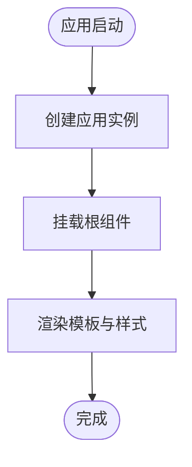

# 技术栈与依赖

<cite>
**本文引用的文件**
- [package.json](file://package.json)
- [rsbuild.config.ts](file://rsbuild.config.ts)
- [biome.json](file://biome.json)
- [tsconfig.json](file://tsconfig.json)
- [src/index.ts](file://src/index.ts)
- [src/App.vue](file://src/App.vue)
- [src/env.d.ts](file://src/env.d.ts)
</cite>

## 目录
1. [引言](#引言)
2. [项目结构](#项目结构)
3. [核心组件](#核心组件)
4. [架构总览](#架构总览)
5. [详细组件分析](#详细组件分析)
6. [依赖关系分析](#依赖关系分析)
7. [性能考量](#性能考量)
8. [故障排查指南](#故障排查指南)
9. [结论](#结论)
10. [附录](#附录)

## 引言
本节面向开发者，系统性阐述 xiuxian 项目的技术栈构成与依赖关系，重点围绕以下方面：
- Vue 3 作为核心框架的角色与优势
- Rsbuild 作为构建工具的定位与能力
- Biome 在代码质量与格式化方面的职责
- TypeScript 提供的类型安全保障
- 版本选择与兼容性考量（尤其是 @rsbuild/core 与 @rsbuild/plugin-vue 的集成）
- 这些技术如何协同工作以提供高效开发体验
- 核心库之间的调用关系与依赖图谱

## 项目结构
该项目采用极简但现代的前端工程化结构：
- 源码位于 src 目录，包含入口脚本、根组件与样式
- 构建配置通过 Rsbuild 的 TypeScript 配置文件集中管理
- 类型与格式化由 TypeScript 与 Biome 共同保障
- 包管理与脚本命令集中在 package.json 中

图表来源
- [package.json](file://package.json#L1-L26)
- [rsbuild.config.ts](file://rsbuild.config.ts#L1-L8)
- [tsconfig.json](file://tsconfig.json#L1-L27)
- [src/index.ts](file://src/index.ts#L1-L6)
- [src/App.vue](file://src/App.vue#L1-L29)

章节来源
- [package.json](file://package.json#L1-L26)
- [rsbuild.config.ts](file://rsbuild.config.ts#L1-L8)
- [tsconfig.json](file://tsconfig.json#L1-L27)
- [src/index.ts](file://src/index.ts#L1-L6)
- [src/App.vue](file://src/App.vue#L1-L29)

## 核心组件
本节从“技术栈角色”角度拆解各核心依赖，并结合配置文件说明其在项目中的职责与边界。

- Vue 3（运行时）
  - 角色：作为响应式 UI 框架，提供组件化开发与虚拟 DOM 能力
  - 在本项目中通过入口脚本创建应用实例并挂载根组件
  - 版本范围 ^3.5.25，确保与现代浏览器与生态兼容

- Rsbuild（构建工具）
  - 角色：零配置、高性能的现代化构建工具，负责打包、开发服务器、预览等
  - 通过插件体系扩展对 Vue 单文件组件的支持
  - 项目脚本直接使用 rsbuild 命令，体现其作为主要构建入口

- Biome（代码质量与格式化）
  - 角色：统一的格式化与静态检查工具，支持 JavaScript/TypeScript/CSS 等
  - 通过配置文件启用推荐规则、导入整理、VCS 集成等
  - 项目脚本提供格式化与检查命令，便于本地与 CI 使用

- TypeScript（类型安全）
  - 角色：提供严格的类型检查与编译时保障，提升可维护性与协作效率
  - 编译选项严格开启，配合 JSX Import Source 与模块解析策略，保证与 Vue SFC 的最佳实践一致

章节来源
- [package.json](file://package.json#L1-L26)
- [biome.json](file://biome.json#L1-L35)
- [tsconfig.json](file://tsconfig.json#L1-L27)
- [src/index.ts](file://src/index.ts#L1-L6)
- [src/App.vue](file://src/App.vue#L1-L29)

## 架构总览
下图展示了从开发到构建的关键流程，以及各工具之间的协作关系。

图表来源
- [package.json](file://package.json#L6-L12)
- [rsbuild.config.ts](file://rsbuild.config.ts#L1-L8)
- [biome.json](file://biome.json#L1-L35)
- [tsconfig.json](file://tsconfig.json#L1-L27)

## 详细组件分析

### Vue 3 与入口应用
- 入口脚本负责创建应用实例并将根组件挂载到页面元素上
- 根组件采用单文件组件形式，包含模板与作用域样式
- 该模式体现了 Vue 3 的组合式 API 与模块化组织方式

图表来源
- [src/index.ts](file://src/index.ts#L1-L6)
- [src/App.vue](file://src/App.vue#L1-L29)

章节来源
- [src/index.ts](file://src/index.ts#L1-L6)
- [src/App.vue](file://src/App.vue#L1-L29)

### Rsbuild 配置与 Vue 插件集成
- 配置文件通过 defineConfig 导出默认配置，并启用 Vue 插件
- 插件负责解析与转换 Vue 单文件组件，使构建管线能够正确处理 .vue 文件
- 该集成方式简化了构建配置，降低维护成本

图表来源
- [rsbuild.config.ts](file://rsbuild.config.ts#L1-L8)

章节来源
- [rsbuild.config.ts](file://rsbuild.config.ts#L1-L8)

### Biome 配置与工作流
- 配置文件启用 VCS 集成、格式化规则与推荐规则集
- 支持导入整理、CSS Modules 解析、单引号与空格缩进等风格约定
- 项目脚本提供格式化与检查命令，便于在本地与 CI 中统一质量标准

图表来源
- [biome.json](file://biome.json#L1-L35)
- [package.json](file://package.json#L6-L12)

章节来源
- [biome.json](file://biome.json#L1-L35)
- [package.json](file://package.json#L6-L12)

### TypeScript 编译配置
- 编译目标与模块系统采用 ESNext 与 bundler 解析策略
- 开启严格类型检查与未使用变量/参数检测
- JSX Import Source 指向 vue，确保与 Vue 组件的 JSX 渲染保持一致

图表来源
- [tsconfig.json](file://tsconfig.json#L1-L27)

章节来源
- [tsconfig.json](file://tsconfig.json#L1-L27)

### 类型声明与 Rsbuild 类型
- 通过环境声明文件引入 Rsbuild 的类型定义，增强编辑器智能感知
- 对 .vue 模块进行类型声明，避免在 TypeScript 中出现模块解析错误

图表来源
- [src/env.d.ts](file://src/env.d.ts#L1-L10)

章节来源
- [src/env.d.ts](file://src/env.d.ts#L1-L10)

## 依赖关系分析
本节从“版本选择与兼容性”的角度，解释各依赖项的选择理由与协同方式，并给出核心库之间的调用关系图。

- 版本选择与兼容性
  - Vue 3：^3.5.25，满足现代浏览器与生态兼容，同时允许小版本更新
  - @rsbuild/core：^1.6.14，作为构建核心，提供稳定的功能与良好的插件生态
  - @rsbuild/plugin-vue：^1.2.1，与 Rsbuild 核心版本匹配，确保 Vue SFC 处理的稳定性
  - TypeScript：^5.9.3，提供最新的语言特性与类型系统优化
  - @biomejs/biome：2.3.8，稳定的代码质量工具，与编辑器/CI 集成良好
  - Node：24.12.0（Volta），确保团队开发环境一致性

- 核心库调用关系
  - Rsbuild 核心负责构建生命周期与资源处理
  - Vue 插件在构建阶段介入，解析与转换 .vue 文件
  - TypeScript 在插件内部或构建管线中参与编译
  - Biome 在开发与 CI 阶段独立运行，提供格式化与检查

图表来源
- [package.json](file://package.json#L6-L21)
- [rsbuild.config.ts](file://rsbuild.config.ts#L1-L8)

章节来源
- [package.json](file://package.json#L6-L21)
- [rsbuild.config.ts](file://rsbuild.config.ts#L1-L8)

## 性能考量
- 构建性能
  - Rsbuild 作为现代化构建工具，具备快速增量构建与热更新能力，适合开发体验
  - Vue 插件对 SFC 的处理已内建优化，减少额外转换开销
- 类型检查
  - TypeScript 严格模式与未使用检测有助于早期发现潜在问题，降低调试成本
- 代码质量
  - Biome 的格式化与检查可在本地与 CI 中快速反馈，减少合并冲突与代码审查负担

## 故障排查指南
- 构建失败（Vue 插件相关）
  - 确认 Rsbuild 配置已启用 Vue 插件
  - 检查 .vue 文件是否符合基本语法规范
  - 参考路径：[rsbuild.config.ts](file://rsbuild.config.ts#L1-L8)

- 类型错误
  - 检查 tsconfig 的编译选项与模块解析策略
  - 确保环境声明文件正确引入 Rsbuild 类型与 .vue 模块声明
  - 参考路径：
    - [tsconfig.json](file://tsconfig.json#L1-L27)
    - [src/env.d.ts](file://src/env.d.ts#L1-L10)

- 格式化/检查问题
  - 使用项目脚本触发 Biome 格式化与检查
  - 检查 biome.json 的规则设置是否与团队约定一致
  - 参考路径：
    - [package.json](file://package.json#L6-L12)
    - [biome.json](file://biome.json#L1-L35)

- 开发服务器无法访问
  - 确认 Rsbuild 开发命令与端口配置
  - 参考路径：[package.json](file://package.json#L6-L12)

章节来源
- [rsbuild.config.ts](file://rsbuild.config.ts#L1-L8)
- [tsconfig.json](file://tsconfig.json#L1-L27)
- [src/env.d.ts](file://src/env.d.ts#L1-L10)
- [package.json](file://package.json#L6-L12)
- [biome.json](file://biome.json#L1-L35)

## 结论
xiuxian 项目通过 Vue 3、Rsbuild、Biome 与 TypeScript 的组合，构建了一个现代化且高效率的前端工作流：
- Vue 3 提供组件化与响应式能力
- Rsbuild 作为构建核心，Vue 插件负责 SFC 处理，形成清晰的职责边界
- Biome 统一格式化与检查，提升代码一致性与可维护性
- TypeScript 提供严格的类型保障，降低运行时风险
- 版本选择兼顾稳定性与生态兼容，确保长期可维护性

## 附录
- 快速参考
  - 开发：使用 Rsbuild 开发服务器
  - 构建：生成生产包
  - 预览：本地预览构建结果
  - 格式化：统一代码风格
  - 检查：静态质量检查
- 参考路径
  - [package.json](file://package.json#L6-L12)
  - [rsbuild.config.ts](file://rsbuild.config.ts#L1-L8)
  - [biome.json](file://biome.json#L1-L35)
  - [tsconfig.json](file://tsconfig.json#L1-L27)