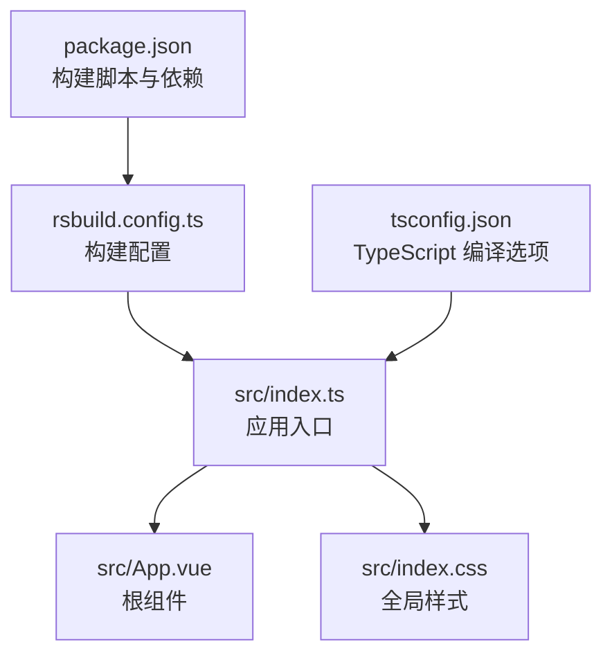
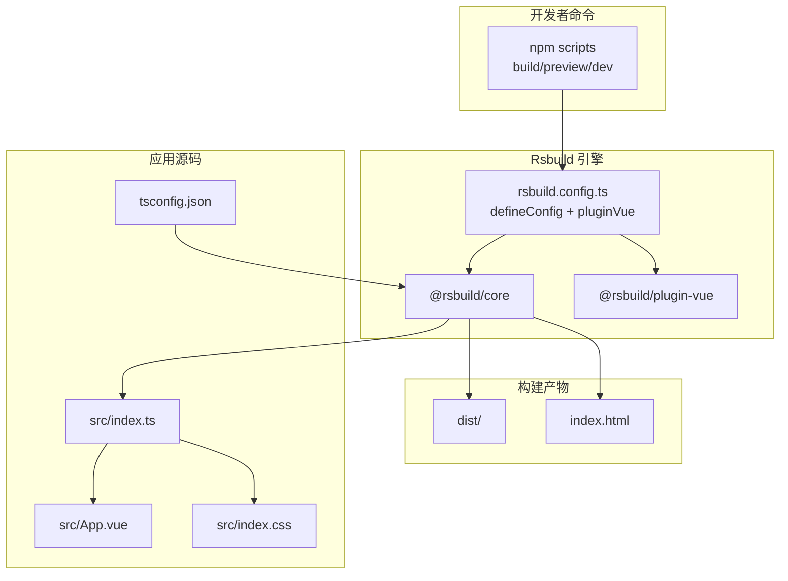
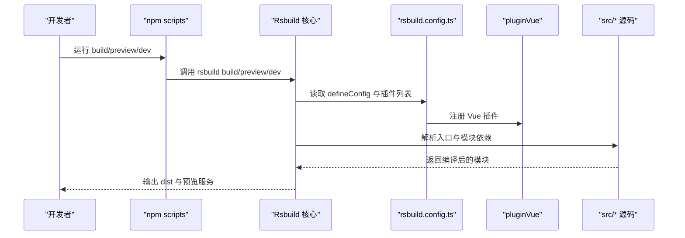
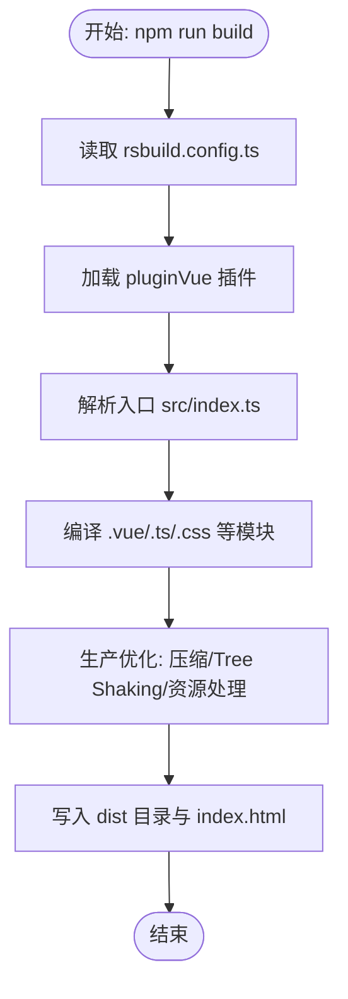
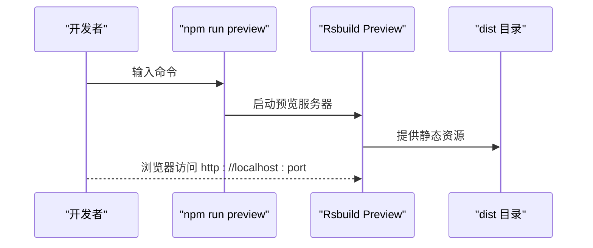
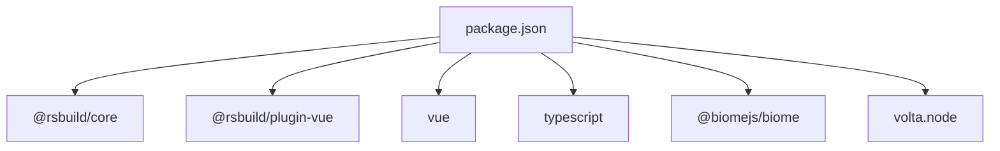

# 构建与部署

<cite>
**本文引用的文件**
- [rsbuild.config.ts](file://rsbuild.config.ts)
- [package.json](file://package.json)
- [README.md](file://README.md)
- [src/index.ts](file://src/index.ts)
- [src/App.vue](file://src/App.vue)
- [src/index.css](file://src/index.css)
- [tsconfig.json](file://tsconfig.json)
- [package-lock.json](file://package-lock.json)
</cite>

## 目录
1. [简介](#简介)
2. [项目结构](#项目结构)
3. [核心组件](#核心组件)
4. [架构总览](#架构总览)
5. [详细组件分析](#详细组件分析)
6. [依赖分析](#依赖分析)
7. [性能考虑](#性能考虑)
8. [故障排查指南](#故障排查指南)
9. [结论](#结论)
10. [附录](#附录)

## 简介
本文件围绕 xiuxian 项目的构建系统与部署流程展开，重点基于 Rsbuild 配置文件与构建脚本，解释 defineConfig 的作用、pluginVue 插件如何支持 Vue 框架，以及 npm run build 与 npm run preview 的工作流程。同时给出配置可扩展性建议、性能优化策略与常见问题排查方法，帮助开发者在不直接阅读源码的情况下也能高效理解与使用该构建体系。

## 项目结构
该项目采用极简前端工程结构：
- 配置层：rsbuild.config.ts 定义构建配置；package.json 提供构建脚本与依赖；tsconfig.json 提供 TypeScript 编译选项。
- 源码层：src 下包含入口脚本、根组件与样式文件。
- 文档层：README.md 提供快速上手与命令说明。

图表来源
- [package.json](file://package.json#L1-L26)
- [rsbuild.config.ts](file://rsbuild.config.ts#L1-L8)
- [src/index.ts](file://src/index.ts#L1-L6)
- [src/App.vue](file://src/App.vue#L1-L29)
- [src/index.css](file://src/index.css#L1-L7)
- [tsconfig.json](file://tsconfig.json#L1-L27)

章节来源
- [package.json](file://package.json#L1-L26)
- [rsbuild.config.ts](file://rsbuild.config.ts#L1-L8)
- [src/index.ts](file://src/index.ts#L1-L6)
- [src/App.vue](file://src/App.vue#L1-L29)
- [src/index.css](file://src/index.css#L1-L7)
- [tsconfig.json](file://tsconfig.json#L1-L27)

## 核心组件
- Rsbuild 核心与插件
  - defineConfig：用于声明式地定义 Rsbuild 构建配置对象，集中管理插件、输出、开发服务器等能力。
  - pluginVue：Rsbuild 的官方 Vue 插件，负责处理 .vue 文件的编译、热更新与打包集成。
- 构建脚本
  - build：调用 rsbuild build 执行生产构建。
  - preview：调用 rsbuild preview 在本地预览生产构建产物。
  - dev：调用 rsbuild dev 启动开发服务器（带自动打开浏览器）。
- 应用入口与组件
  - src/index.ts：创建 Vue 应用并挂载到 DOM。
  - src/App.vue：根组件，包含模板与样式。
  - src/index.css：全局样式，影响页面基础视觉。
- TypeScript 配置
  - tsconfig.json：启用 ESNext 模块解析、严格类型检查、保留 JSX 等，确保与 Rsbuild/Vue 生态兼容。

章节来源
- [rsbuild.config.ts](file://rsbuild.config.ts#L1-L8)
- [package.json](file://package.json#L1-L26)
- [src/index.ts](file://src/index.ts#L1-L6)
- [src/App.vue](file://src/App.vue#L1-L29)
- [src/index.css](file://src/index.css#L1-L7)
- [tsconfig.json](file://tsconfig.json#L1-L27)

## 架构总览
下图展示了从命令到构建产物的关键路径，以及 Rsbuild 如何通过插件机制集成 Vue 能力。

图表来源
- [package.json](file://package.json#L1-L26)
- [rsbuild.config.ts](file://rsbuild.config.ts#L1-L8)
- [src/index.ts](file://src/index.ts#L1-L6)
- [src/App.vue](file://src/App.vue#L1-L29)
- [src/index.css](file://src/index.css#L1-L7)
- [tsconfig.json](file://tsconfig.json#L1-L27)

## 详细组件分析

### Rsbuild 配置与插件机制
- defineConfig 的作用
  - 将构建配置以函数式方式集中声明，便于扩展与维护。在本项目中，它用于注册 Vue 插件，使 Rsbuild 能识别并处理 .vue 文件。
- pluginVue() 的作用
  - 作为 Rsbuild 插件，负责将 Vue SFC 编译为可在浏览器运行的 JavaScript，并与 Rsbuild 的开发服务器、热更新、打包链路无缝衔接。
- 配置文件与构建脚本的交互
  - package.json 中的 scripts 字段将构建命令映射到 rsbuild 命令；rsbuild 在执行时读取 rsbuild.config.ts 并加载插件，最终生成产物。

图表来源
- [package.json](file://package.json#L1-L26)
- [rsbuild.config.ts](file://rsbuild.config.ts#L1-L8)
- [src/index.ts](file://src/index.ts#L1-L6)
- [src/App.vue](file://src/App.vue#L1-L29)
- [src/index.css](file://src/index.css#L1-L7)

章节来源
- [rsbuild.config.ts](file://rsbuild.config.ts#L1-L8)
- [package.json](file://package.json#L1-L26)

### 生产构建流程（npm run build）
- 触发链路
  - npm run build -> rsbuild build -> 读取 rsbuild.config.ts -> 加载 pluginVue -> 编译入口与依赖 -> 产出 dist 目录与 index.html。
- 代码压缩与资源优化
  - Rsbuild 默认在生产模式下进行代码压缩、Tree Shaking、资源内联/外链策略等优化。具体行为由底层打包器与 Rsbuild 插件共同决定。
- 输出结构
  - 产物通常包含静态资源文件（如 JS/CSS/图片）与入口 HTML。dist 目录即为生产环境可直接部署的目录。

图表来源
- [package.json](file://package.json#L1-L26)
- [rsbuild.config.ts](file://rsbuild.config.ts#L1-L8)
- [src/index.ts](file://src/index.ts#L1-L6)
- [src/App.vue](file://src/App.vue#L1-L29)
- [src/index.css](file://src/index.css#L1-L7)

章节来源
- [package.json](file://package.json#L1-L26)
- [rsbuild.config.ts](file://rsbuild.config.ts#L1-L8)

### 本地预览（npm run preview）
- 触发链路
  - npm run preview -> rsbuild preview -> 启动本地静态服务器 -> 提供 dist 目录内容，模拟真实部署环境。
- 用途
  - 在本地验证生产构建产物是否符合预期，避免“开发正常、上线异常”的情况。

图表来源
- [package.json](file://package.json#L1-L26)
- [README.md](file://README.md#L19-L37)

章节来源
- [package.json](file://package.json#L1-L26)
- [README.md](file://README.md#L19-L37)

### Rsbuild 配置的可扩展性与自定义选项
- 可扩展点
  - 插件生态：除 Vue 插件外，还可按需引入其他 Rsbuild 插件（如样式、图片、HTML 模板等），在 rsbuild.config.ts 中统一注册。
  - 构建目标与输出：可通过 defineConfig 的字段调整输出目录、公共路径、资源命名策略等。
  - 开发服务器：可配置端口、代理、HTTPS 等。
- 添加自定义构建选项的步骤
  - 在 rsbuild.config.ts 中通过 defineConfig 扩展配置项。
  - 若需要额外能力，安装对应 Rsbuild 插件并在 plugins 数组中注册。
  - 通过 package.json 的 scripts 字段或 Rsbuild CLI 参数驱动新功能。

章节来源
- [rsbuild.config.ts](file://rsbuild.config.ts#L1-L8)
- [package.json](file://package.json#L1-L26)

## 依赖分析
- 核心依赖
  - @rsbuild/core：Rsbuild 核心引擎，提供构建与开发能力。
  - @rsbuild/plugin-vue：Vue 插件，支持 .vue 单文件组件编译与热更新。
  - vue：运行时依赖，用于创建与渲染应用。
- 工具链依赖
  - typescript：提供类型检查与编译能力。
  - @biomejs/biome：格式化与检查工具（与构建无直接耦合，但有助于开发体验）。
- 运行时要求
  - package.json 指定 Node 版本要求，确保 Rsbuild 与插件在受支持环境中运行。

图表来源
- [package.json](file://package.json#L1-L26)
- [package-lock.json](file://package-lock.json#L388-L579)

章节来源
- [package.json](file://package.json#L1-L26)
- [package-lock.json](file://package-lock.json#L388-L579)

## 性能考虑
- 构建性能优化建议
  - 使用生产模式构建（默认已开启），减少不必要的调试信息与冗余代码。
  - 合理拆分包与懒加载，降低首屏体积。
  - 启用资源缓存与长缓存策略（如文件名哈希），提升二次加载速度。
  - 控制第三方库体积，优先选择 Tree Shaking 友好的包。
  - 使用合适的插件组合，避免重复或冲突的处理链。
- 开发体验优化
  - 启动开发服务器时启用 HMR，提升迭代效率。
  - 合理设置端口与代理，避免端口冲突与跨域问题。

[本节为通用性能建议，不直接分析具体文件，故无章节来源]

## 故障排查指南
- 常见问题与解决思路
  - Node 版本不满足要求：检查 package.json 中的 Node 版本约束，升级至受支持版本。
  - 插件未生效：确认 rsbuild.config.ts 中已正确注册 pluginVue，并且版本与 @rsbuild/core 兼容。
  - Vue 组件无法识别：确保 .vue 文件被 pluginVue 处理，且入口文件正确导入根组件。
  - 预览失败：确认已先执行构建，dist 目录存在；若端口被占用，修改预览端口或释放端口。
  - 样式未生效：检查全局样式文件是否被入口正确引入，以及打包后样式是否被正确注入。
- 调试建议
  - 查看构建日志，定位插件或模块解析阶段的问题。
  - 临时移除部分插件或简化入口，缩小问题范围。
  - 对比不同环境下的构建产物，确认缓存与依赖差异。

章节来源
- [package.json](file://package.json#L1-L26)
- [rsbuild.config.ts](file://rsbuild.config.ts#L1-L8)
- [src/index.ts](file://src/index.ts#L1-L6)
- [src/App.vue](file://src/App.vue#L1-L29)
- [src/index.css](file://src/index.css#L1-L7)

## 结论
xiuxian 项目通过简洁的 Rsbuild 配置与标准的 npm 脚本，实现了对 Vue 应用的高效构建与本地预览。defineConfig 与 pluginVue 的配合，使得 .vue 文件的编译与热更新成为开箱即用的能力。生产构建默认包含代码压缩与资源优化，预览命令则提供了接近真实部署的本地验证环境。开发者可在现有基础上按需扩展插件与配置，进一步提升构建效率与产物质量。

[本节为总结性内容，不直接分析具体文件，故无章节来源]

## 附录
- 快速上手
  - 安装依赖后，使用 npm run dev 启动开发服务器；使用 npm run build 生成生产构建；使用 npm run preview 本地预览。
- 参考文档
  - Rsbuild 官方文档与仓库地址已在 README 中提供，可作为进一步学习的参考。

章节来源
- [README.md](file://README.md#L1-L37)