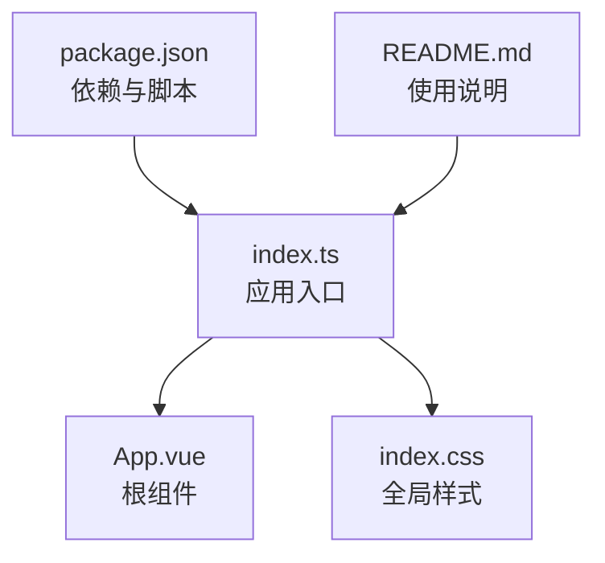
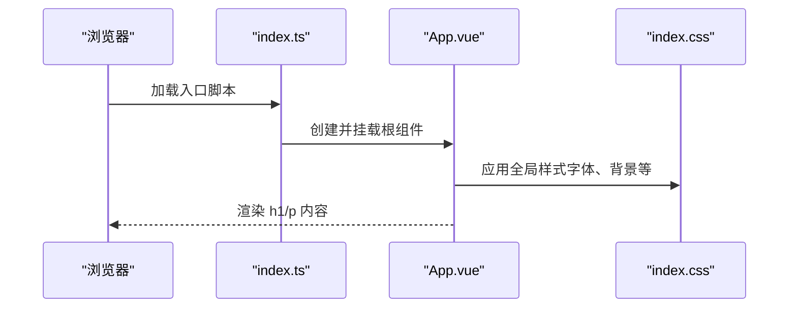
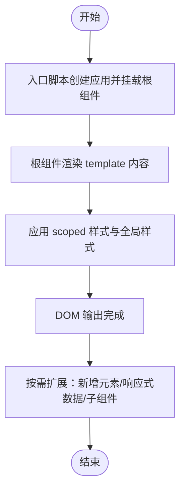
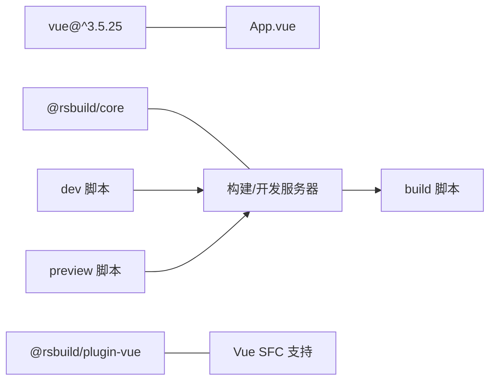

# App.vue 组件详解

<cite>
**本文引用的文件**
- [src/App.vue](file://src/App.vue)
- [src/index.ts](file://src/index.ts)
- [src/index.css](file://src/index.css)
- [package.json](file://package.json)
- [README.md](file://README.md)
</cite>

## 目录
1. [引言](#引言)
2. [项目结构](#项目结构)
3. [核心组件](#核心组件)
4. [架构总览](#架构总览)
5. [详细组件分析](#详细组件分析)
6. [依赖关系分析](#依赖关系分析)
7. [性能考量](#性能考量)
8. [故障排查指南](#故障排查指南)
9. [结论](#结论)
10. [附录](#附录)

## 引言
本文件围绕 App.vue 组件进行系统性解析，重点覆盖：
- template 部分的语义化布局与内容组织
- style scoped 的作用机制与 CSS 作用域隔离原理
- .content 类通过 Flexbox 实现垂直居中与全视口高度布局的技术细节
- 字体大小、字重与透明度的设计意图
- 渲染流程与可扩展性建议（新增元素、响应式数据、集成其他组件）
- 常见问题定位与解决思路（样式未生效、布局错乱）

## 项目结构
该项目采用最小化但完整的 Vue 3 + Rsbuild 开发栈，入口为 index.ts，根组件为 App.vue，全局样式由 index.css 提供基础排版与背景。

图表来源
- [src/index.ts](file://src/index.ts#L1-L6)
- [src/App.vue](file://src/App.vue#L1-L29)
- [src/index.css](file://src/index.css#L1-L7)
- [package.json](file://package.json#L1-L26)
- [README.md](file://README.md#L1-L37)

章节来源
- [src/index.ts](file://src/index.ts#L1-L6)
- [src/App.vue](file://src/App.vue#L1-L29)
- [src/index.css](file://src/index.css#L1-L7)
- [package.json](file://package.json#L1-L26)
- [README.md](file://README.md#L1-L37)

## 核心组件
App.vue 是一个极简的根组件，包含两个语义化标题与段落，配合 scoped 样式实现居中布局与视觉层次。其职责清晰：作为应用的“容器”，承载基础内容与样式，便于后续扩展。

章节来源
- [src/App.vue](file://src/App.vue#L1-L29)

## 架构总览
下图展示了从应用入口到根组件的渲染路径，以及全局样式对根组件的影响。

图表来源
- [src/index.ts](file://src/index.ts#L1-L6)
- [src/App.vue](file://src/App.vue#L1-L29)
- [src/index.css](file://src/index.css#L1-L7)

## 详细组件分析

### Template 结构与语义化布局
- 容器层：使用一个类名为 content 的 div 作为整体布局容器，承载标题与段落。
- 标题层：h1 用于主标题，强调品牌或项目名称，具备较大的字号与较粗的字重，形成视觉焦点。
- 段落层：p 用于补充说明文案，字号相对较小，字重较细，透明度降低以弱化次要信息，提升对比度与可读性。

设计意图
- 通过语义化标签明确内容层级，利于 SEO 与无障碍访问。
- 文案简洁直接，符合现代 Web 设计“少即是多”的原则。

章节来源
- [src/App.vue](file://src/App.vue#L1-L6)

### Style Scoped 作用机制与隔离原理
- 作用范围：scoped 样式仅对当前组件生效，避免样式泄漏至其他组件或全局命名冲突。
- 实现原理：构建工具（Rsbuild + @rsbuild/plugin-vue）在编译阶段为组件选择器添加唯一后缀或作用域标记，使样式仅匹配当前组件模板中的元素。
- 在本项目中，.content 及其后代选择器（h1、p）均被限定在 App.vue 内部生效。

优势
- 组件化开发时，样式解耦更彻底，便于团队协作与复用。
- 降低全局样式的维护成本，减少意外覆盖风险。

章节来源
- [src/App.vue](file://src/App.vue#L8-L29)
- [package.json](file://package.json#L16-L21)

### Flexbox 垂直居中与全视口高度布局
.content 的关键属性组合实现了“全视口高度 + 垂直居中”：
- min-height: 100vh：确保容器至少占满一屏高度，即使内容不足也能撑满视口。
- display: flex 与 flex-direction: column：将子元素纵向排列。
- justify-content: center：在主轴上实现居中对齐，使 h1 与 p 在视口中垂直居中。
- text-align: center：文本水平居中，统一视觉重心。
- line-height: 1.1：微调行高，提升标题与段落的紧凑感与可读性。

设计意图
- 全屏居中布局能快速建立一致的首屏体验，适用于引导页、登录页或纯展示型页面。
- 纵向堆叠的 Flex 排列天然适配移动端与不同屏幕尺寸。

章节来源
- [src/App.vue](file://src/App.vue#L9-L16)

### 字体大小、字重与透明度的设计意图
- h1：较大字号与较粗字重，突出主标题，形成强视觉引导。
- p：较小字号与较细字重，降低信息密度，同时通过透明度进一步弱化次要信息，避免喧宾夺主。
- 整体色彩与字体族来自全局样式（index.css），保证一致性与可读性。

章节来源
- [src/App.vue](file://src/App.vue#L18-L27)
- [src/index.css](file://src/index.css#L1-L7)

### 渲染流程与可扩展性建议
渲染流程（基于现有代码）
- 入口脚本创建 Vue 应用并挂载根组件。
- 根组件渲染 template 内容，应用 scoped 样式，最终输出到 DOM。
- 全局样式为 body 提供字体、颜色与背景，影响根组件的视觉表现。

可扩展性建议
- 新增元素：在 template 中添加新的语义化标签（如 h2、ul/li、button 等），并在 App.vue 的样式中为其定义 scoped 规则，保持样式隔离。
- 引入响应式数据：在 script 中声明响应式状态（如 ref 或 reactive），在 template 中绑定显示逻辑，实现动态文案或条件渲染。
- 集成其他组件：通过 import 导入子组件并在 template 中使用，利用 props 与 emits 进行通信，保持 App.vue 的职责边界清晰。

图表来源
- [src/index.ts](file://src/index.ts#L1-L6)
- [src/App.vue](file://src/App.vue#L1-L29)
- [src/index.css](file://src/index.css#L1-L7)

章节来源
- [src/index.ts](file://src/index.ts#L1-L6)
- [src/App.vue](file://src/App.vue#L1-L29)

## 依赖关系分析
- 运行时依赖：Vue 3（框架核心）
- 构建与插件：@rsbuild/core（打包与开发服务器）、@rsbuild/plugin-vue（Vue 单文件组件支持）
- 脚本命令：dev、build、preview、check、format（开发、构建、预览与格式化检查）

图表来源
- [package.json](file://package.json#L13-L21)

章节来源
- [package.json](file://package.json#L1-L26)

## 性能考量
- 样式体积：当前样式极简，无额外第三方样式库，有利于首屏加载速度。
- 渲染开销：组件结构简单，无复杂计算属性或侦听器，渲染开销低。
- 可扩展时的性能建议：
  - 将大体量样式拆分为多个 scoped 组件，避免单文件样式膨胀。
  - 使用虚拟滚动或懒加载策略处理长列表（若后续引入）。
  - 合理使用 v-if/v-show 控制条件渲染，避免不必要的 DOM 更新。

## 故障排查指南
- 样式未生效
  - 检查是否正确使用 scoped，确认选择器与模板元素匹配。
  - 确认构建工具已启用 @rsbuild/plugin-vue 并正常工作。
  - 若需要穿透样式，考虑使用深度选择器（在支持的构建环境下）。
- 布局错乱
  - 检查 .content 是否被外部样式覆盖（如全局样式或第三方样式）。
  - 确认 min-height: 100vh 在目标设备上的表现（部分移动端浏览器存在地址栏遮挡问题）。
  - 如需更稳定的全屏高度，可结合媒体查询或视口单位调整。
- 文本不居中
  - 确认父容器 display: flex 与 justify-content: center 生效。
  - 检查是否存在其他 Flex 属性（如 align-items）影响了垂直对齐。
- 字体与颜色异常
  - 确认全局 index.css 已正确导入且优先级高于组件内样式。
  - 检查字体族在目标系统中的可用性与回退方案。

章节来源
- [src/App.vue](file://src/App.vue#L8-L29)
- [src/index.css](file://src/index.css#L1-L7)
- [package.json](file://package.json#L16-L21)

## 结论
App.vue 以极简结构实现了清晰的语义化布局与稳定的全屏居中效果，配合 scoped 样式与全局基础样式，构成一个易于扩展、维护成本低的根组件。通过合理引入响应式数据与子组件，可在不破坏作用域隔离的前提下逐步增强功能与交互体验。

## 附录
- 快速启动与构建
  - 开发：执行开发脚本以启动本地服务。
  - 构建：生成生产版本产物。
  - 预览：在本地预览生产构建效果。
- 参考资源
  - Rsbuild 官方文档与仓库链接详见项目说明。

章节来源
- [README.md](file://README.md#L1-L37)
- [package.json](file://package.json#L7-L12)