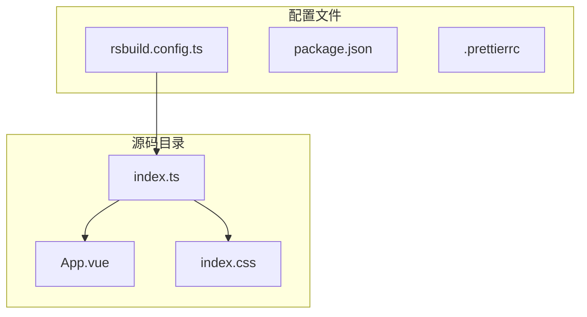
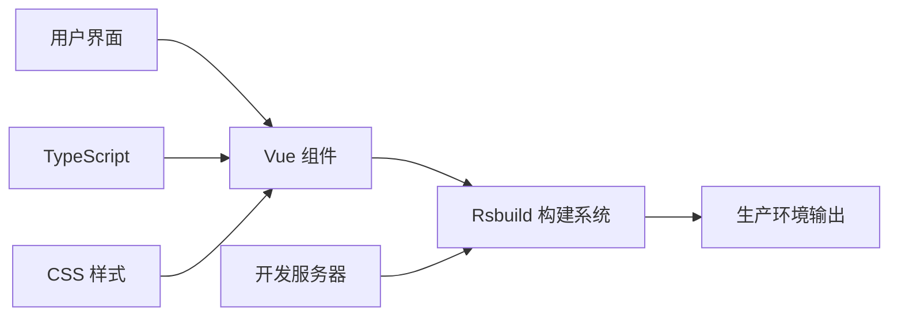
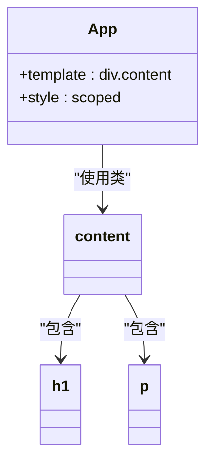
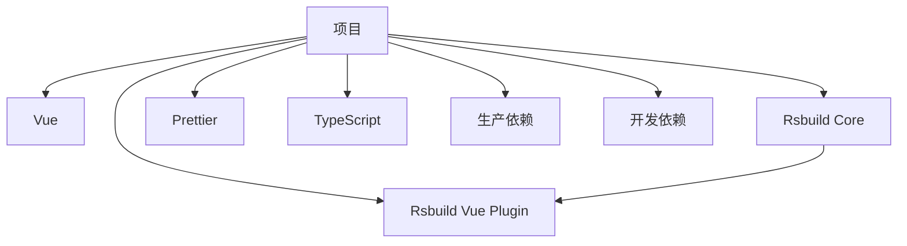

# SCSS 工具类

<cite>
**本文档中引用的文件**  
- [App.vue](file://src/App.vue)
- [index.css](file://src/index.css)
- [index.ts](file://src/index.ts)
- [rsbuild.config.ts](file://rsbuild.config.ts)
- [package.json](file://package.json)
- [README.md](file://README.md)
</cite>

## 目录
1. [介绍](#介绍)
2. [项目结构](#项目结构)
3. [核心组件](#核心组件)
4. [架构概述](#架构概述)
5. [详细组件分析](#详细组件分析)
6. [依赖分析](#依赖分析)
7. [性能考虑](#性能考虑)
8. [故障排除指南](#故障排除指南)
9. [结论](#结论)

## 介绍
本项目是一个基于 Rsbuild 构建的 Vue 应用程序，旨在提供一个现代化的前端开发环境。尽管项目名称为“xiuxian”，但其主要功能是展示如何使用 Rsbuild 与 Vue 框架进行高效开发。项目中虽然提到了 SCSS 工具类，但在当前代码库中并未实际实现或使用 SCSS 文件。所有样式均以 CSS 形式直接编写，并通过 `index.css` 和组件内 `<style>` 标签引入。

**Section sources**
- [README.md](file://README.md#L1-L37)
- [package.json](file://package.json#L1-L25)

## 项目结构
该项目采用标准的前端项目结构，包含源代码目录 `src`、构建配置文件和依赖管理文件。主要结构如下：
- `src/`：存放所有源代码，包括主应用组件 `App.vue`、入口文件 `index.ts` 和全局样式 `index.css`
- 根目录下包含构建工具配置（`rsbuild.config.ts`）、包管理配置（`package.json`）和代码格式化配置（`.prettierrc`）
- 项目使用 TypeScript（通过 `env.d.ts` 声明）并配置了 Prettier 进行代码格式化

尽管项目结构支持 SCSS（通过 `.prettierrc` 中的配置），但目前没有实际的 SCSS 文件被使用。

**Diagram sources**
- [rsbuild.config.ts](file://rsbuild.config.ts#L1-L8)
- [index.ts](file://src/index.ts#L1-L5)

**Section sources**
- [rsbuild.config.ts](file://rsbuild.config.ts#L1-L8)
- [package.json](file://package.json#L1-L25)
- [src/index.ts](file://src/index.ts#L1-L5)

## 核心组件
项目的核心组件是 `App.vue`，它定义了应用的用户界面。该组件使用简单的 CSS 样式来实现居中布局和基本的视觉样式。虽然项目配置支持 SCSS，但当前实现中并未使用任何 SCSS 特性或工具类。

**Section sources**
- [App.vue](file://src/App.vue#L1-L28)
- [index.css](file://src/index.css#L1-L6)

## 架构概述
该项目采用典型的 Vue 单页应用架构，由 Rsbuild 提供构建支持。整体架构简洁明了，专注于快速启动和开发体验。Rsbuild 配置中启用了 Vue 插件，确保 Vue 组件能够正确编译。

**Diagram sources**
- [rsbuild.config.ts](file://rsbuild.config.ts#L1-L8)
- [App.vue](file://src/App.vue#L1-L28)

## 详细组件分析

### App.vue 分析
`App.vue` 是项目的主组件，包含一个简单的模板和作用域样式。组件使用 Flexbox 实现垂直居中布局，文本颜色为白色，背景由 `index.css` 定义的渐变色提供。

**Diagram sources**
- [App.vue](file://src/App.vue#L1-L28)

**Section sources**
- [App.vue](file://src/App.vue#L1-L28)

### 样式系统分析
项目中的样式系统目前仅使用原生 CSS。`index.css` 文件定义了全局样式，包括重置 margin、设置字体和背景渐变。`App.vue` 中的作用域样式进一步定义了 `.content` 容器的布局属性。

值得注意的是，`.prettierrc` 配置文件中明确包含了对 SCSS 文件的支持，表明项目具备使用 SCSS 的能力，但尚未实际应用。

**Section sources**
- [index.css](file://src/index.css#L1-L6)
- [.prettierrc](file://.prettierrc#L1-L75)

## 依赖分析
项目依赖关系简单明了，主要依赖 Vue 3 和 Rsbuild 构建工具。开发依赖包括 Rsbuild 的 Vue 插件、Prettier 和 TypeScript。

**Diagram sources**
- [package.json](file://package.json#L1-L25)

**Section sources**
- [package.json](file://package.json#L1-L25)

## 性能考虑
由于项目非常简单，性能方面没有复杂的优化需求。Rsbuild 的默认配置已经提供了良好的开发和生产构建性能。未来如果引入 SCSS 工具类系统，建议考虑以下性能优化：
- 使用 SCSS 的模块化功能避免样式重复
- 启用 CSS 压缩和代码分割
- 考虑使用 CSS 变量替代部分 SCSS 变量以提高运行时性能

## 故障排除指南
当项目无法正常运行时，请检查以下常见问题：
1. 确保 Node.js 版本为 24.12.0（通过 Volta 锁定）
2. 检查 Rsbuild 是否正确安装
3. 确认 Vue 插件在 Rsbuild 配置中已启用
4. 如果计划使用 SCSS，需要确保安装了相应的预处理器依赖

**Section sources**
- [package.json](file://package.json#L21-L23)
- [rsbuild.config.ts](file://rsbuild.config.ts#L1-L8)

## 结论
该项目提供了一个简洁的 Rsbuild + Vue 开发环境，虽然名为“SCSS 工具类”，但当前实现中并未包含实际的 SCSS 功能。项目结构清晰，配置合理，为未来添加 SCSS 支持和工具类系统提供了良好的基础。建议下一步添加 SCSS 预处理器支持，并创建实际的 mixins 和 variables 文件来实现真正的 SCSS 工具类系统。