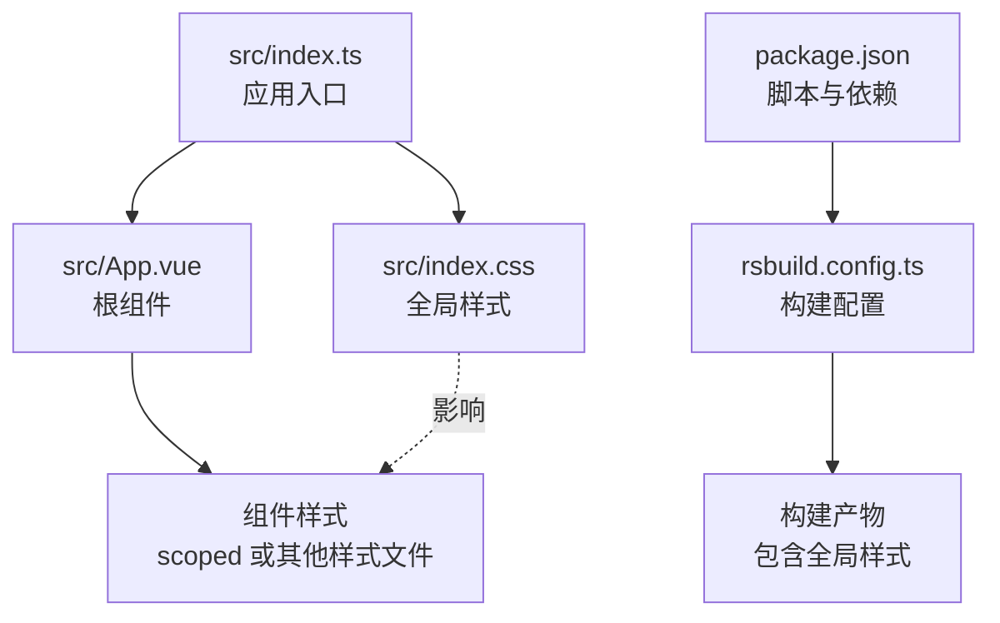
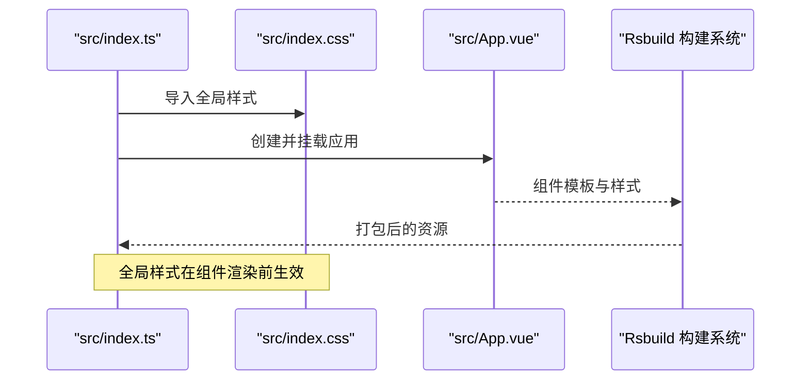
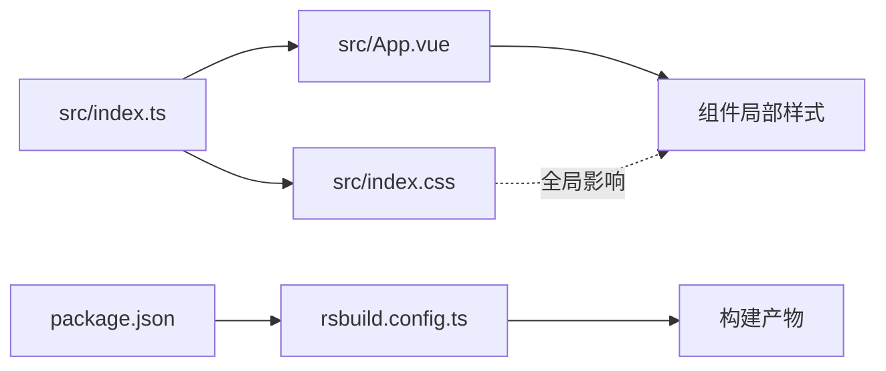

# index.css 全局样式说明

<cite>
**本文引用的文件**
- [src/index.css](file://src/index.css)
- [src/index.ts](file://src/index.ts)
- [rsbuild.config.ts](file://rsbuild.config.ts)
- [package.json](file://package.json)
- [src/App.vue](file://src/App.vue)
</cite>

## 目录
1. [简介](#简介)
2. [项目结构](#项目结构)
3. [核心组件](#核心组件)
4. [架构总览](#架构总览)
5. [详细组件分析](#详细组件分析)
6. [依赖分析](#依赖分析)
7. [性能考虑](#性能考虑)
8. [故障排查指南](#故障排查指南)
9. [结论](#结论)
10. [附录](#附录)

## 简介
本文件围绕 src/index.css 作为全局样式入口的作用与配置进行系统化说明。该文件通过 body 选择器统一设置页面基础视觉与排版风格，包括无边距布局、默认文字颜色、字体栈与深色背景渐变等关键属性。本文将解释这些属性的意义与实现原理，并结合构建流程说明其对全应用的全局影响；同时给出可扩展建议（如自定义字体、响应式断点与暗色主题），并强调该文件虽小但关键，任何语法错误都可能造成样式失效。

## 项目结构
本项目的前端采用 Vue 3 + Rsbuild 构建工具链，全局样式通过入口脚本集中引入，随后由构建系统打包到最终产物中，供所有组件共享使用。

图表来源
- [src/index.ts](file://src/index.ts#L1-L6)
- [src/index.css](file://src/index.css#L1-L7)
- [rsbuild.config.ts](file://rsbuild.config.ts#L1-L8)
- [package.json](file://package.json#L1-L26)
- [src/App.vue](file://src/App.vue#L1-L29)

章节来源
- [src/index.ts](file://src/index.ts#L1-L6)
- [rsbuild.config.ts](file://rsbuild.config.ts#L1-L8)
- [package.json](file://package.json#L1-L26)

## 核心组件
- 全局样式入口：src/index.css
  - 作用：为整个页面提供基础样式骨架，包括边距归零、默认文字颜色、字体栈与背景渐变。
  - 影响范围：对所有组件生效（非 scoped 样式），是全局视觉基调的基石。
- 应用入口：src/index.ts
  - 作用：在应用启动时导入全局样式，确保样式在组件渲染前已就绪。
- 构建配置：rsbuild.config.ts
  - 作用：启用 Vue 插件，使样式与模板协同工作；全局样式随构建流程被打包。

章节来源
- [src/index.css](file://src/index.css#L1-L7)
- [src/index.ts](file://src/index.ts#L1-L6)
- [rsbuild.config.ts](file://rsbuild.config.ts#L1-L8)

## 架构总览
下图展示了从入口到全局样式的加载路径与运行时关系：

图表来源
- [src/index.ts](file://src/index.ts#L1-L6)
- [src/index.css](file://src/index.css#L1-L7)
- [src/App.vue](file://src/App.vue#L1-L29)
- [rsbuild.config.ts](file://rsbuild.config.ts#L1-L8)

## 详细组件分析

### 全局样式文件：src/index.css
- 选择器与属性概览
  - body 选择器：作为页面根元素的全局样式入口，统一设置页面基础外观。
  - margin: 0：消除浏览器默认边距，便于实现无边距布局与精确的栅格控制。
  - color: #fff：设置默认文字颜色为白色，保证在深色背景上具备良好对比度。
  - font-family：定义字体栈，优先使用现代字体 Inter，其次 Avenir、Helvetica、Arial，最后回退到 sans-serif，确保跨平台一致的排版体验。
  - background-image：使用线性渐变从深蓝到更深蓝的垂直渐变，营造统一的深色背景视觉效果，提升沉浸感与品牌调性。
- 加载方式与构建流程
  - 在应用入口中显式导入全局样式，构建系统会将其打包进最终产物。
  - Rsbuild 配置启用了 Vue 插件，确保模板与样式协同处理。
- 对组件的影响
  - 由于未使用 scoped，全局样式对所有组件生效，包括默认文字颜色、字体与背景等。
  - 组件内部可通过更具体的选择器覆盖全局样式，但需注意层叠顺序与特异性。
- 错误与风险
  - 语法错误会导致样式失效，影响整体视觉与可读性。
  - 过度依赖全局样式可能降低组件封装性，建议配合局部样式与设计系统规范使用。

章节来源
- [src/index.css](file://src/index.css#L1-L7)
- [src/index.ts](file://src/index.ts#L1-L6)
- [rsbuild.config.ts](file://rsbuild.config.ts#L1-L8)

### 应用入口：src/index.ts
- 职责：创建 Vue 应用实例，挂载根组件，并导入全局样式。
- 关键点：导入顺序决定样式是否先于组件渲染生效，避免“闪烁”或样式错乱。

章节来源
- [src/index.ts](file://src/index.ts#L1-L6)

### 根组件：src/App.vue
- 特点：使用 scoped 样式，仅影响当前组件模板内的元素。
- 与全局样式的交互：全局样式为组件提供基础视觉环境（如字体、文字颜色、背景），组件样式在此基础上叠加。

章节来源
- [src/App.vue](file://src/App.vue#L1-L29)

### 构建配置：rsbuild.config.ts
- 功能：启用 @rsbuild/plugin-vue，使 Vue 单文件组件的模板与样式得到正确处理。
- 与全局样式的关联：构建系统负责将全局样式打包到最终产物中，确保运行时可用。

章节来源
- [rsbuild.config.ts](file://rsbuild.config.ts#L1-L8)

### 依赖与脚本：package.json
- scripts：提供开发、构建、预览与格式化检查等命令，支撑本地调试与生产构建。
- 依赖：包含 Vue 与 Rsbuild 生态相关依赖，为全局样式的加载与打包提供基础。

章节来源
- [package.json](file://package.json#L1-L26)

## 依赖分析
- 模块耦合
  - src/index.ts 与 src/index.css 存在直接导入关系，确保全局样式在应用启动时加载。
  - Rsbuild 配置与 Vue 插件共同保障样式与模板的协同处理。
- 外部依赖
  - Vue：提供组件化能力与模板渲染。
  - Rsbuild：提供打包与构建能力，承载全局样式的打包输出。
- 潜在问题
  - 若构建配置缺失 Vue 插件，可能导致样式无法正确打包或运行时报错。
  - 若入口未导入全局样式，组件将无法继承全局字体、颜色与背景等基础样式。

图表来源
- [src/index.ts](file://src/index.ts#L1-L6)
- [src/index.css](file://src/index.css#L1-L7)
- [src/App.vue](file://src/App.vue#L1-L29)
- [rsbuild.config.ts](file://rsbuild.config.ts#L1-L8)
- [package.json](file://package.json#L1-L26)

章节来源
- [src/index.ts](file://src/index.ts#L1-L6)
- [src/index.css](file://src/index.css#L1-L7)
- [src/App.vue](file://src/App.vue#L1-L29)
- [rsbuild.config.ts](file://rsbuild.config.ts#L1-L8)
- [package.json](file://package.json#L1-L26)

## 性能考虑
- 样式体积：全局样式文件极小，对首屏加载影响有限。
- 渐变背景：线性渐变为纯 CSS 实现，无需额外资源请求，性能开销低。
- 字体加载：字体栈包含系统字体与现代字体，通常无需额外网络请求；若后续引入自定义字体，需关注加载策略与缓存。
- 重绘与重排：全局样式主要影响渲染层，不会引发大量重排；合理使用选择器可减少不必要的样式计算。

## 故障排查指南
- 症状：页面无样式或样式异常
  - 排查要点：
    - 确认入口已导入全局样式。
    - 检查构建配置是否启用 Vue 插件。
    - 检查是否存在语法错误导致样式失效。
- 症状：文字颜色与预期不符
  - 排查要点：
    - 检查全局文字颜色是否被组件局部样式覆盖。
    - 确认字体栈在目标设备上的可用性。
- 症状：背景未显示或颜色异常
  - 排查要点：
    - 检查背景渐变声明是否正确。
    - 确认组件内是否有覆盖背景的样式。

章节来源
- [src/index.ts](file://src/index.ts#L1-L6)
- [src/index.css](file://src/index.css#L1-L7)
- [rsbuild.config.ts](file://rsbuild.config.ts#L1-L8)

## 结论
src/index.css 作为全局样式入口，承担着统一页面基础视觉与排版的关键职责。它通过无边距布局、默认文字颜色、字体栈与深色背景渐变，为应用奠定一致的视觉基调。在当前构建流程中，入口脚本负责导入全局样式，Rsbuild 配置确保样式与模板协同工作。尽管文件体量小，但其对全局的影响显著，任何语法错误都会导致样式失效。建议在保持全局简洁的前提下，结合组件局部样式与设计系统规范，逐步扩展字体、断点与主题能力。

## 附录

### 扩展建议
- 自定义字体
  - 引入 Web 字体并在字体栈中优先使用，注意加载策略与回退方案，避免阻塞渲染。
- 响应式断点
  - 在全局样式中定义常用断点变量，配合媒体查询实现一致的响应式行为。
- 暗色主题支持
  - 提供明暗主题切换机制，通过 CSS 变量或类名切换实现平滑过渡。
- 可访问性
  - 确保对比度符合标准，为高对比模式提供备用配色。
- 维护与测试
  - 建立样式审查流程，避免过度依赖全局样式；对关键样式变更进行回归测试。

### 语法与兼容性提示
- 语法错误可能导致样式完全失效，应通过构建日志与浏览器开发者工具定位问题。
- 跨平台字体差异可通过字体栈与系统回退策略缓解，必要时引入 Web 字体。