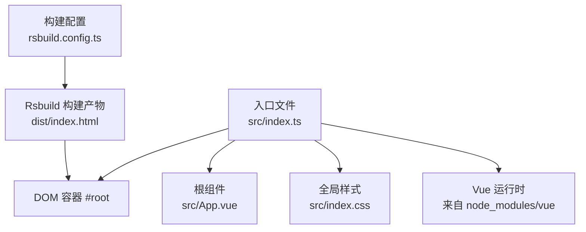
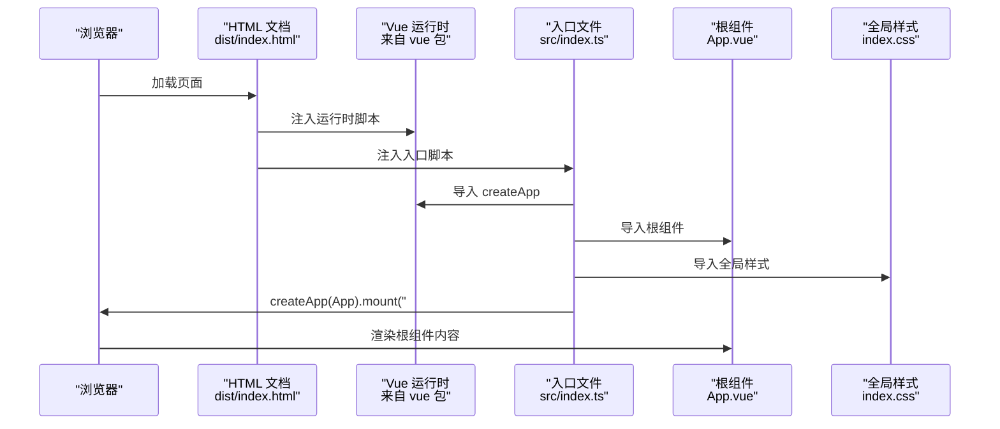
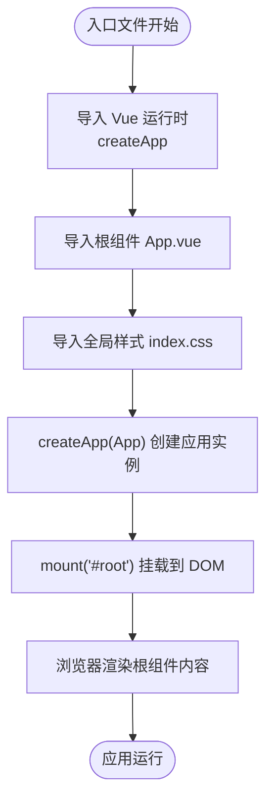
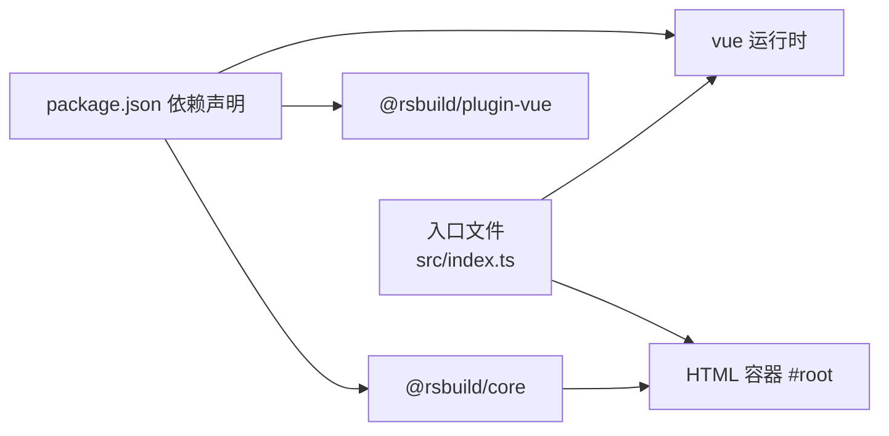

# index.ts 应用入口分析

<cite>
**本文引用的文件**
- [src/index.ts](file://src/index.ts)
- [src/App.vue](file://src/App.vue)
- [src/index.css](file://src/index.css)
- [package.json](file://package.json)
- [rsbuild.config.ts](file://rsbuild.config.ts)
- [dist/index.html](file://dist/index.html)
</cite>

## 目录
1. [简介](#简介)
2. [项目结构](#项目结构)
3. [核心组件](#核心组件)
4. [架构总览](#架构总览)
5. [详细组件分析](#详细组件分析)
6. [依赖分析](#依赖分析)
7. [性能考虑](#性能考虑)
8. [故障排查指南](#故障排查指南)
9. [结论](#结论)
10. [附录](#附录)

## 简介
本文件聚焦于应用入口文件 src/index.ts 的职责与执行流程，系统性解析以下关键点：
- 如何通过 import 语句引入 Vue 3 的应用创建函数
- 根组件 App.vue 的模块加载机制
- 全局样式 index.css 的引入时机与作用
- createApp(App).mount('#root') 的完整执行过程及其生命周期位置
- 在入口文件中集成插件（如 Vue Router 或 Pinia）的方法
- 常见问题排查（挂载失败、组件未渲染等）

该入口文件采用最小化设计，体现了现代前端构建工具链（Rsbuild + Vue 插件）下“零配置即用”的开发体验。

## 项目结构
入口文件位于 src/index.ts，负责：
- 导入 Vue 运行时与应用创建函数
- 导入根组件 App.vue
- 导入全局样式 index.css
- 创建应用实例并挂载到 DOM 节点 #root

Rsbuild 配置启用 @rsbuild/plugin-vue，使 .vue 文件可直接被入口导入；构建产物会在 HTML 中注入运行时与入口脚本，并在 body 内预留 #root 容器。

图表来源
- [src/index.ts](file://src/index.ts#L1-L6)
- [src/App.vue](file://src/App.vue#L1-L29)
- [src/index.css](file://src/index.css#L1-L7)
- [rsbuild.config.ts](file://rsbuild.config.ts#L1-L8)
- [dist/index.html](file://dist/index.html#L1-L1)

章节来源
- [src/index.ts](file://src/index.ts#L1-L6)
- [rsbuild.config.ts](file://rsbuild.config.ts#L1-L8)
- [dist/index.html](file://dist/index.html#L1-L1)

## 核心组件
- Vue 运行时与应用创建函数：通过 import { createApp } from 'vue' 引入，用于创建应用实例。
- 根组件 App.vue：作为应用的顶层容器，包含模板与样式。
- 全局样式 index.css：为整个页面提供基础样式，如字体、背景色等。
- DOM 容器 #root：由构建产物注入到 dist/index.html 的 body 中，入口文件将其作为挂载目标。

章节来源
- [src/index.ts](file://src/index.ts#L1-L6)
- [src/App.vue](file://src/App.vue#L1-L29)
- [src/index.css](file://src/index.css#L1-L7)
- [dist/index.html](file://dist/index.html#L1-L1)

## 架构总览
入口文件承担“装配”角色：将运行时、根组件与样式整合，并将应用挂载到 #root。Rsbuild 通过 @rsbuild/plugin-vue 支持 .vue 单文件组件的编译与打包，最终在浏览器中按顺序执行入口逻辑。

图表来源
- [src/index.ts](file://src/index.ts#L1-L6)
- [src/App.vue](file://src/App.vue#L1-L29)
- [src/index.css](file://src/index.css#L1-L7)
- [dist/index.html](file://dist/index.html#L1-L1)

## 详细组件分析

### 模块导入与执行时机
- import { createApp } from 'vue'
  - 作用：引入 Vue 3 的应用创建函数，用于构造应用实例。
  - 执行时机：模块加载阶段，属于静态导入，随入口脚本一同被浏览器下载与执行。
- import App from './App.vue'
  - 作用：导入根组件模块，供后续 createApp(App) 使用。
  - 执行时机：模块加载阶段，与 createApp 同步执行。
- import './index.css'
  - 作用：引入全局样式，影响页面基础视觉表现。
  - 执行时机：模块加载阶段，通常在应用启动前完成样式注入。

章节来源
- [src/index.ts](file://src/index.ts#L1-L3)

### 应用创建与挂载流程
- createApp(App)
  - 作用：基于根组件 App 创建一个应用实例。
  - 行为：返回一个应用上下文对象，可用于注册插件、全局属性等。
- .mount('#root')
  - 作用：将应用实例挂载到 DOM 元素 #root。
  - 生命周期位置：在入口文件末尾调用，确保在此之前已完成模块导入与应用配置。
  - 注意：若 #root 不存在或尚未渲染，挂载会失败。

图表来源
- [src/index.ts](file://src/index.ts#L1-L6)
- [dist/index.html](file://dist/index.html#L1-L1)

章节来源
- [src/index.ts](file://src/index.ts#L1-L6)
- [dist/index.html](file://dist/index.html#L1-L1)

### 在入口文件中集成插件
以下为常见插件集成的步骤说明（不包含具体代码，仅提供路径与方法）：
- 集成 Vue Router
  - 步骤：在入口文件中导入路由实例，然后在应用实例上调用 app.use(router)。
  - 参考路径：在入口文件中添加插件注册调用。
- 集成 Pinia
  - 步骤：在入口文件中导入并创建 Store 实例，然后在应用实例上调用 app.use(store)。
  - 参考路径：在入口文件中添加插件注册调用。
- 集成其他插件
  - 步骤：在入口文件中导入插件并在 app 上调用 app.use(plugin)。
  - 参考路径：在入口文件中添加插件注册调用。

章节来源
- [src/index.ts](file://src/index.ts#L1-L6)

### 样式与主题
- 全局样式 index.css
  - 作用：设置基础字体、颜色与背景，保证页面整体风格一致。
  - 影响范围：对整个页面生效，包括根组件渲染出的内容。
- 组件级样式
  - App.vue 使用了 scoped 样式，确保样式不会污染外部元素。

章节来源
- [src/index.css](file://src/index.css#L1-L7)
- [src/App.vue](file://src/App.vue#L1-L29)

## 依赖分析
- 运行时依赖
  - vue：提供 createApp 与运行时能力。
- 构建依赖
  - @rsbuild/core：构建工具核心。
  - @rsbuild/plugin-vue：支持 .vue 单文件组件的编译与打包。
- 入口文件与构建产物的关系
  - Rsbuild 将入口文件打包为入口脚本，并在 HTML 中通过 script defer 方式注入。
  - HTML 中存在 #root 容器，入口文件将其作为挂载目标。

图表来源
- [package.json](file://package.json#L1-L26)
- [rsbuild.config.ts](file://rsbuild.config.ts#L1-L8)
- [src/index.ts](file://src/index.ts#L1-L6)
- [dist/index.html](file://dist/index.html#L1-L1)

章节来源
- [package.json](file://package.json#L1-L26)
- [rsbuild.config.ts](file://rsbuild.config.ts#L1-L8)
- [dist/index.html](file://dist/index.html#L1-L1)

## 性能考虑
- 模块加载顺序
  - 入口文件中的静态导入按顺序执行，建议保持简洁以减少首屏阻塞。
- 构建优化
  - Rsbuild 默认会对入口脚本进行分包与缓存策略，确保运行时与入口脚本按需加载。
- 样式加载
  - 全局样式与入口脚本一起注入，建议避免在入口处加载过大的样式资源，以免影响首屏渲染。

## 故障排查指南
- 挂载失败
  - 现象：控制台报错提示无法找到 #root。
  - 排查要点：确认 HTML 是否包含 #root 容器；检查构建产物是否正确注入入口脚本。
  - 参考路径：检查 dist/index.html 中是否存在 #root。
- 组件未渲染
  - 现象：页面空白或仅有全局样式。
  - 排查要点：确认入口文件已调用 mount；检查根组件是否导出默认组件；确认样式未覆盖导致内容不可见。
- 插件未生效
  - 现象：路由或状态管理功能异常。
  - 排查要点：确认在入口文件中正确导入并注册插件；检查插件初始化顺序是否在 mount 之前。
- 样式冲突
  - 现象：组件样式未生效或被全局样式覆盖。
  - 排查要点：检查 scoped 样式使用；核对全局样式优先级。

章节来源
- [dist/index.html](file://dist/index.html#L1-L1)
- [src/index.ts](file://src/index.ts#L1-L6)
- [src/App.vue](file://src/App.vue#L1-L29)
- [src/index.css](file://src/index.css#L1-L7)

## 结论
src/index.ts 以极简方式完成了 Vue 3 应用的装配与挂载，配合 Rsbuild 的 Vue 插件与构建配置，实现了从开发到生产的无缝衔接。通过理解模块导入顺序、应用创建与挂载时机，以及在入口文件中集成插件的标准流程，可以快速扩展应用功能并有效定位常见问题。

## 附录
- 入口文件路径参考
  - [src/index.ts](file://src/index.ts#L1-L6)
- 根组件路径参考
  - [src/App.vue](file://src/App.vue#L1-L29)
- 全局样式路径参考
  - [src/index.css](file://src/index.css#L1-L7)
- 构建配置路径参考
  - [rsbuild.config.ts](file://rsbuild.config.ts#L1-L8)
- HTML 容器参考
  - [dist/index.html](file://dist/index.html#L1-L1)