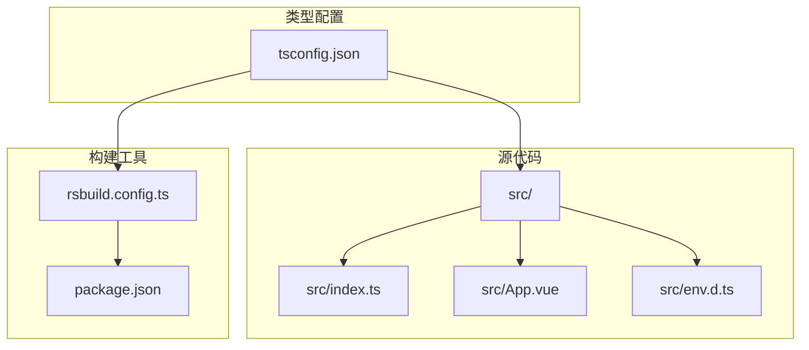
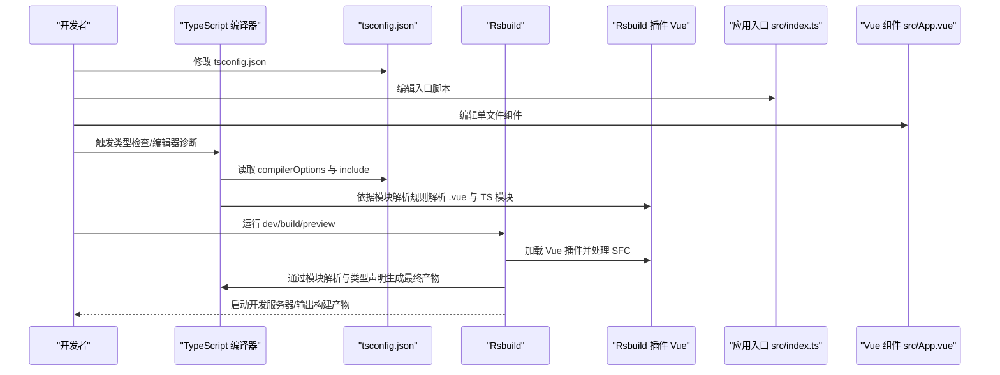
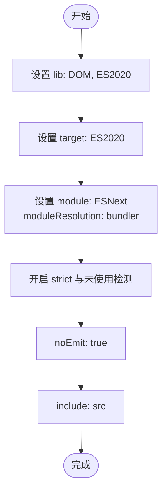
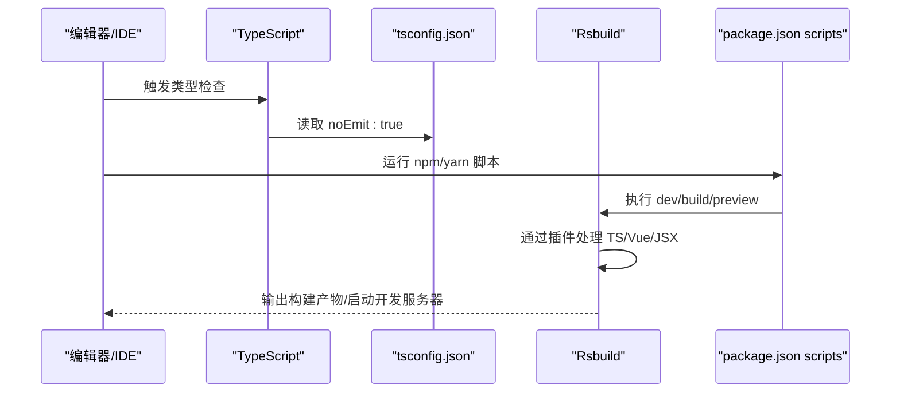
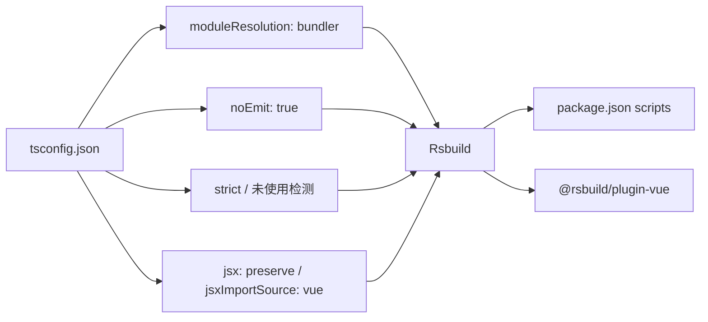

# tsconfig.json 配置解析

<cite>
**本文引用的文件**
- [tsconfig.json](file://tsconfig.json)
- [package.json](file://package.json)
- [rsbuild.config.ts](file://rsbuild.config.ts)
- [src/index.ts](file://src/index.ts)
- [src/App.vue](file://src/App.vue)
- [src/env.d.ts](file://src/env.d.ts)
</cite>

## 目录
1. [引言](#引言)
2. [项目结构](#项目结构)
3. [核心组件](#核心组件)
4. [架构总览](#架构总览)
5. [详细组件分析](#详细组件分析)
6. [依赖关系分析](#依赖关系分析)
7. [性能考量](#性能考量)
8. [故障排查指南](#故障排查指南)
9. [结论](#结论)

## 引言
本文件系统性解读 tsconfig.json 中的各项 TypeScript 编译配置，聚焦于 Vue 3 + TypeScript + Rsbuild 的开发环境。我们将逐项说明 compilerOptions 的关键选项（如 lib、target、module、moduleResolution、strict 等）及其对类型检查、模块解析与构建流程的影响；解释 noEmit: true 的作用以及与 Rsbuild 的协作方式；并结合项目实际给出常见类型错误的调试建议。

## 项目结构
该仓库采用“前端应用 + 构建工具”的典型结构：
- 源码位于 src 目录，包含入口脚本、Vue 单文件组件与样式资源
- 使用 Rsbuild 作为打包与开发服务器，通过插件支持 Vue 单文件组件
- TypeScript 仅用于类型检查与模块解析，不直接产出编译后的 JS 文件（noEmit: true）

图表来源
- [tsconfig.json](file://tsconfig.json#L1-L26)
- [rsbuild.config.ts](file://rsbuild.config.ts#L1-L8)
- [package.json](file://package.json#L1-L26)
- [src/index.ts](file://src/index.ts#L1-L6)
- [src/App.vue](file://src/App.vue#L1-L29)
- [src/env.d.ts](file://src/env.d.ts#L1-L10)

章节来源
- [tsconfig.json](file://tsconfig.json#L1-L26)
- [rsbuild.config.ts](file://rsbuild.config.ts#L1-L8)
- [package.json](file://package.json#L1-L26)

## 核心组件
本节从“配置项—能力—影响”的角度，逐项解析 tsconfig.json 的关键 compilerOptions 与 include：

- lib：指定 DOM 与 ES2020 库支持
  - 影响：为浏览器端代码提供 DOM API 与 ES2020 语法的类型声明，避免在使用 window、document 等全局对象时出现“未找到模块”或“类型未定义”的报错
  - 结合点：与 target、moduleResolution 共同确保浏览器运行时 API 可用且模块解析兼容

- target：编译目标为 ES2020
  - 影响：控制 TypeScript 将高级语法降级到 ES2020 的程度；配合 Rsbuild 的转译与打包，可获得更现代的运行时特性
  - 结合点：与 module: ESNext、moduleResolution: bundler 协作，减少不必要的降级开销

- module 与 moduleResolution：ESNext 与 bundler
  - 影响：module: ESNext 使 TS 保留原生 ES 模块语法；moduleResolution: bundler 让模块解析遵循打包器策略，避免 Node.js 的 CommonJS 解析差异导致的路径问题
  - 结合点：与 verbatimModuleSyntax、resolveJsonModule 等选项共同保证 JSON 导入、严格模块语法等行为符合打包器预期

- jsx 与 jsxImportSource：preserve 与 vue
  - 影响：保留 JSX/TSX 语法至打包阶段，交由 Rsbuild 插件处理；jsxImportSource 指定 Vue 的 JSX 工厂函数来源，便于在 TS 中编写模板风格的渲染逻辑
  - 结合点：与 Vue 单文件组件的编译链路一致，确保 SFC 内部的渲染函数与外部导入保持一致的 JSX 处理流程

- noEmit：true
  - 影响：TypeScript 不生成任何 JS/JS.map 文件，所有产物由 Rsbuild 统一产出
  - 结合点：与 package.json 中的 scripts（dev/build/preview）配合，避免重复构建与冲突

- skipLibCheck：true
  - 影响：跳过对库文件的类型检查，显著提升开发时的诊断速度
  - 结合点：在大型依赖树下尤为有效，同时仍能保证用户代码的类型安全

- useDefineForClassFields：true
  - 影响：启用 ECMAScript 原生的类字段初始化语法，避免旧版 TS 默认行为带来的兼容性差异
  - 结合点：与 target: ES2020 保持一致，确保类字段语义与运行时一致

- modules 分组下的其他选项
  - moduleDetection: force：强制启用模块检测，有助于在混合模块环境中识别 ES/AMD/CommonJS
  - verbatimModuleSyntax：true：严格保留原始模块语法，减少不必要的转换
  - resolveJsonModule：true：允许导入 .json 文件
  - allowImportingTsExtensions：true：允许导入 .ts/.tsx/.d.ts 扩展名
  - noUncheckedSideEffectImports：true：对可能产生副作用的导入进行更严格的检查

- type checking 分组下的严格选项
  - strict：true：开启全面的严格类型检查，包括严格空值检查、严格函数参数等
  - noUnusedLocals：true：禁止未使用的局部变量
  - noUnusedParameters：true：禁止未使用的函数参数
  - 结合点：与 skipLibCheck 平衡，既保证用户代码质量，又避免第三方库带来的检查开销

- include：["src"]
  - 影响：限定类型检查范围仅覆盖 src 目录，减少不必要的扫描与检查成本
  - 结合点：与 Rsbuild 的入口脚本 src/index.ts 对齐，确保入口与组件均被纳入类型检查

章节来源
- [tsconfig.json](file://tsconfig.json#L1-L26)
- [src/index.ts](file://src/index.ts#L1-L6)
- [src/App.vue](file://src/App.vue#L1-L29)
- [src/env.d.ts](file://src/env.d.ts#L1-L10)

## 架构总览
下图展示了 tsconfig.json 如何与 Rsbuild、Vue 单文件组件及入口脚本协同工作，形成“类型检查—模块解析—构建产出”的闭环。

图表来源
- [tsconfig.json](file://tsconfig.json#L1-L26)
- [rsbuild.config.ts](file://rsbuild.config.ts#L1-L8)
- [src/index.ts](file://src/index.ts#L1-L6)
- [src/App.vue](file://src/App.vue#L1-L29)

## 详细组件分析

### 类型配置与模块解析协同
- 目标与库支持
  - target 与 lib 的组合确保浏览器端 API 与现代语法得到正确类型声明
  - 在浏览器运行时，DOM 与 ES2020 的类型声明为 window/document、Promise、ArrayBuffer 等提供保障
- 模块系统与解析策略
  - module: ESNext 与 moduleResolution: bundler 的搭配，使 TS 保留原生 ES 模块语法，同时让打包器决定最终模块格式
  - verbatimModuleSyntax 与 allowImportingTsExtensions 提升了对 TS 模块与扩展名导入的兼容性
  - resolveJsonModule 与 noUncheckedSideEffectImports 有助于在现代工程中安全地导入 JSON 与处理副作用导入
- JSX 与 Vue 集成
  - jsx: preserve 与 jsxImportSource: vue 使 TS 将 JSX/TSX 语法交给 Rsbuild 插件处理，保持与 Vue 渲染函数的一致性
- 严格类型检查
  - strict、noUnusedLocals、noUnusedParameters 等选项共同提升代码质量，减少潜在运行时风险

图表来源
- [tsconfig.json](file://tsconfig.json#L1-L26)

章节来源
- [tsconfig.json](file://tsconfig.json#L1-L26)

### noEmit: true 的作用与 Rsbuild 协作
- noEmit: true 的意义
  - TypeScript 不生成任何 JS/JS.map 文件，避免与 Rsbuild 的构建产物发生冲突
  - 开发体验更流畅，编辑器与 IDE 的类型检查与增量编译更快
- 与 Rsbuild 的协作
  - Rsbuild 作为统一的构建管线，负责将 TS、Vue 单文件组件、CSS 等资源编译与打包
  - Rsbuild 插件会处理 .vue 文件的编译、JSX/TSX 的转换以及最终产物的生成
- 与 package.json scripts 的配合
  - scripts 中的 dev/build/preview 均由 Rsbuild 执行，确保类型检查与构建流程一致

图表来源
- [tsconfig.json](file://tsconfig.json#L1-L26)
- [package.json](file://package.json#L1-L26)
- [rsbuild.config.ts](file://rsbuild.config.ts#L1-L8)

章节来源
- [tsconfig.json](file://tsconfig.json#L1-L26)
- [package.json](file://package.json#L1-L26)
- [rsbuild.config.ts](file://rsbuild.config.ts#L1-L8)

### include 与类型检查范围
- include: ["src"] 的作用
  - 限定类型检查仅覆盖 src 目录，减少不必要的扫描与检查成本
  - 与应用入口脚本 src/index.ts 对齐，确保入口与组件均被纳入类型检查
- 与 env.d.ts 的配合
  - env.d.ts 为 Rsbuild 类型与 .vue 模块提供声明，确保 TS 能正确识别 Vue 组件与 Rsbuild 的类型

章节来源
- [tsconfig.json](file://tsconfig.json#L1-L26)
- [src/env.d.ts](file://src/env.d.ts#L1-L10)
- [src/index.ts](file://src/index.ts#L1-L6)

## 依赖关系分析
- tsconfig.json 与 Rsbuild 的耦合
  - 模块解析策略（moduleResolution: bundler）与打包器期望一致，避免路径解析差异导致的类型或运行时错误
  - noEmit: true 与 Rsbuild 的构建流程互补，避免重复构建
- tsconfig.json 与 Vue 生态
  - jsxImportSource: vue 与 Rsbuild 插件 Vue 协同，确保 .vue 文件的编译与 JSX 处理一致
  - lib: DOM 与 target: ES2020 为 Vue 组件中的浏览器 API 使用提供类型支持
- 与 package.json 的脚本联动
  - scripts 中的 dev/build/preview 由 Rsbuild 执行，类型检查与构建流程统一

图表来源
- [tsconfig.json](file://tsconfig.json#L1-L26)
- [package.json](file://package.json#L1-L26)
- [rsbuild.config.ts](file://rsbuild.config.ts#L1-L8)

章节来源
- [tsconfig.json](file://tsconfig.json#L1-L26)
- [package.json](file://package.json#L1-L26)
- [rsbuild.config.ts](file://rsbuild.config.ts#L1-L8)

## 性能考量
- 跳过库类型检查：skipLibCheck: true 显著降低类型检查时间，尤其在依赖较多时收益明显
- 严格但不过度：strict 与未使用检测提升质量，但需平衡检查成本；可在 CI 中开启更严格的检查
- 模块解析优化：bundler 解析策略与 ESNext 模块保留，减少不必要的降级与转换
- noEmit：避免重复构建，缩短开发反馈周期

## 故障排查指南
- “找不到模块”或“未找到类型声明”
  - 检查 lib 是否包含 DOM；确认 target 与运行环境一致
  - 确认 moduleResolution: bundler 与打包器策略一致
- “未使用变量/参数”报错
  - 启用 strict、noUnusedLocals、noUnusedParameters 后，未使用的局部变量或参数会被视为错误
  - 若确有需要，可临时注释或重构以满足类型要求
- “JSX/TSX 语法未被识别”
  - 确认 jsx: preserve 与 jsxImportSource: vue 的配置一致
  - 确保 Rsbuild 插件 Vue 已正确加载
- “JSON 导入失败”
  - 确认 resolveJsonModule: true 已启用
- “Vue 组件类型不匹配”
  - 检查 env.d.ts 中对 .vue 模块的声明是否正确
  - 确认入口脚本 src/index.ts 正确导入组件

章节来源
- [tsconfig.json](file://tsconfig.json#L1-L26)
- [src/env.d.ts](file://src/env.d.ts#L1-L10)
- [src/index.ts](file://src/index.ts#L1-L6)
- [src/App.vue](file://src/App.vue#L1-L29)

## 结论
本项目的 tsconfig.json 通过合理的 compilerOptions 与 include 配置，为 Vue 3 + TypeScript + Rsbuild 的开发环境提供了坚实基础：
- lib 与 target 确保浏览器端 API 与现代语法的类型支持
- module 与 moduleResolution 与 Rsbuild 的 bundler 策略协同，避免模块解析差异
- noEmit: true 与 Rsbuild 的构建流程互补，提升开发效率
- include 限定类型检查范围，兼顾性能与准确性
- 严格类型检查与未使用检测进一步提升代码质量

在实际开发中，建议结合 Rsbuild 的插件生态与编辑器的类型诊断能力，持续优化配置以适配团队规范与项目演进。