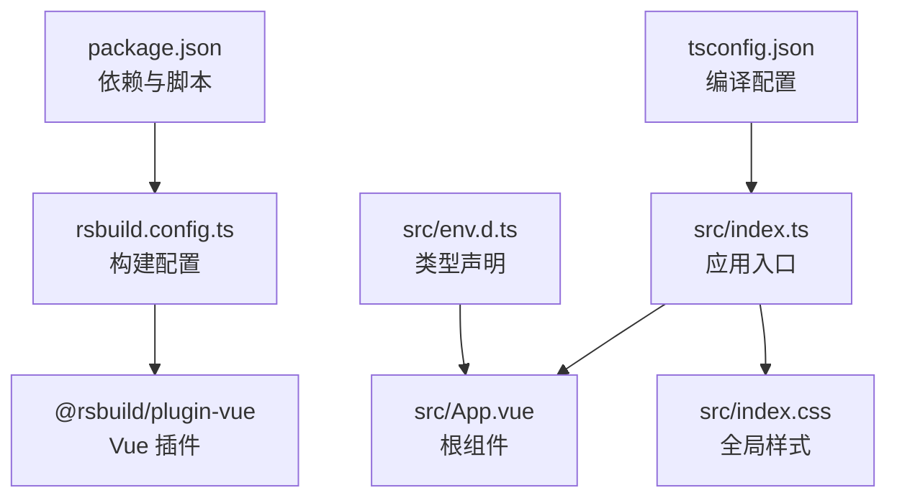
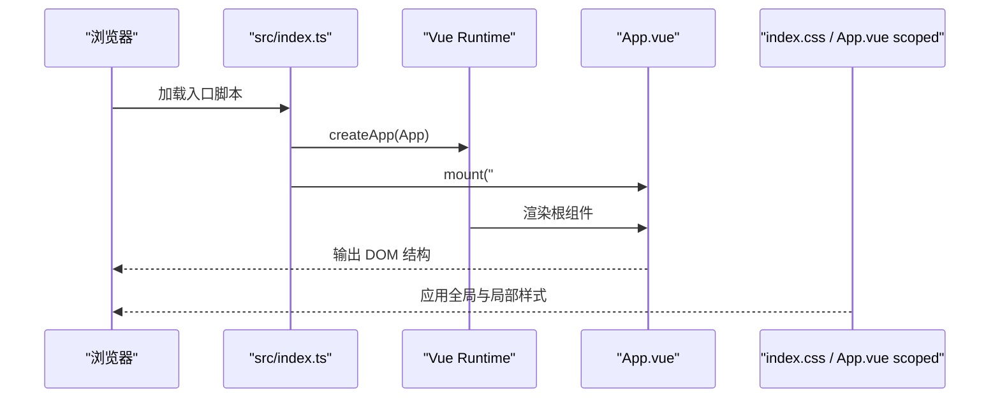
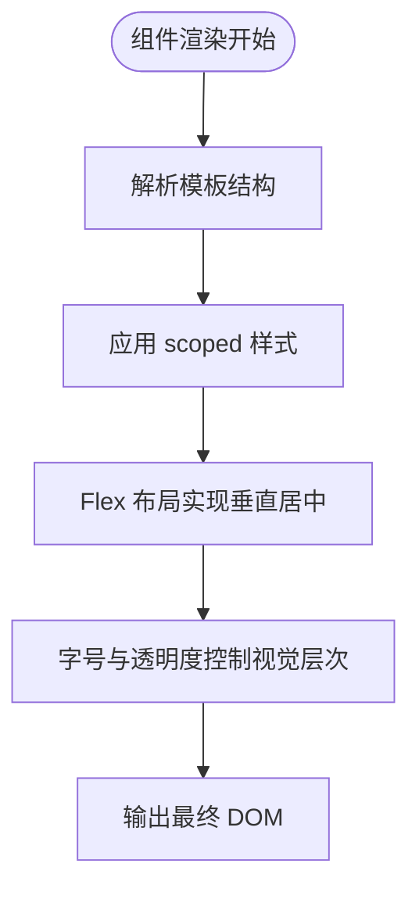
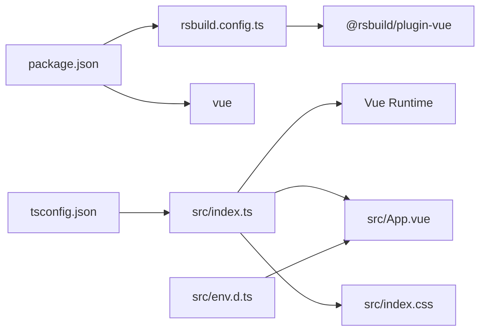

# 核心文件说明

<cite>
**本文引用的文件**
- [src/index.ts](file://src/index.ts)
- [src/App.vue](file://src/App.vue)
- [src/index.css](file://src/index.css)
- [tsconfig.json](file://tsconfig.json)
- [rsbuild.config.ts](file://rsbuild.config.ts)
- [package.json](file://package.json)
- [src/env.d.ts](file://src/env.d.ts)
- [README.md](file://README.md)
</cite>

## 目录
1. [引言](#引言)
2. [项目结构](#项目结构)
3. [核心组件](#核心组件)
4. [架构总览](#架构总览)
5. [详细组件分析](#详细组件分析)
6. [依赖分析](#依赖分析)
7. [性能考虑](#性能考虑)
8. [故障排查指南](#故障排查指南)
9. [结论](#结论)
10. [附录](#附录)

## 引言
本文件围绕项目的核心源码展开，重点从入口文件 src/index.ts 出发，解释 createApp(App).mount('#root') 的启动机制与 DOM 挂载流程；深入解析 App.vue 的模板结构、scoped 样式的作用域机制，以及 CSS 如何实现居中布局与视觉层次；同时说明 index.css 作为全局样式的潜在用途，并结合 tsconfig.json 对 TypeScript 编译配置的影响进行说明。最后给出基于现有代码的扩展建议，帮助开发者在不破坏现有结构的前提下进行组件拆分与状态管理引入。

## 项目结构
该项目采用极简的前端工程组织方式：
- 入口脚本：src/index.ts 负责创建应用实例并将根组件挂载到 DOM。
- 根组件：src/App.vue 提供页面级模板与样式。
- 全局样式：src/index.css 定义基础排版与背景。
- 构建配置：rsbuild.config.ts 集成 @rsbuild/plugin-vue 插件以支持 Vue 单文件组件。
- 类型声明：src/env.d.ts 声明 .vue 文件模块类型，确保 TS 能正确识别 Vue 组件。
- 编译配置：tsconfig.json 控制 TypeScript 编译选项与包含范围。
- 工程元信息：package.json 管理依赖与脚本命令。

图表来源
- [src/index.ts](file://src/index.ts#L1-L6)
- [src/App.vue](file://src/App.vue#L1-L29)
- [src/index.css](file://src/index.css#L1-L7)
- [rsbuild.config.ts](file://rsbuild.config.ts#L1-L8)
- [package.json](file://package.json#L1-L26)
- [tsconfig.json](file://tsconfig.json#L1-L27)
- [src/env.d.ts](file://src/env.d.ts#L1-L10)

章节来源
- [src/index.ts](file://src/index.ts#L1-L6)
- [src/App.vue](file://src/App.vue#L1-L29)
- [src/index.css](file://src/index.css#L1-L7)
- [rsbuild.config.ts](file://rsbuild.config.ts#L1-L8)
- [package.json](file://package.json#L1-L26)
- [tsconfig.json](file://tsconfig.json#L1-L27)
- [src/env.d.ts](file://src/env.d.ts#L1-L10)

## 核心组件
- 应用入口与挂载流程
  - 入口文件通过导入 Vue 的 createApp 并传入根组件 App，随后调用 mount 将应用挂载到 id 为 root 的 DOM 节点上。该流程是标准的 Vue 3 应用启动模式。
- 根组件 App.vue
  - 模板层包含一个容器元素与标题、段落文本，用于展示基础信息。
  - 样式层使用 scoped 作用域限定，避免样式泄漏至其他组件。
  - 通过 Flexbox 实现垂直居中布局，配合字号与透明度控制视觉层次。
- 全局样式 index.css
  - 设置 body 的基础排版、字体族与渐变背景，为页面提供统一的视觉基调。
- 构建与类型支持
  - Rsbuild 配置启用 @rsbuild/plugin-vue，使 .vue 文件可被直接导入。
  - env.d.ts 声明 .vue 模块类型，确保 TS 在编译期能识别 Vue 组件。
  - tsconfig.json 启用严格类型检查与 ESNext 模块解析，保证开发体验与产物质量。

章节来源
- [src/index.ts](file://src/index.ts#L1-L6)
- [src/App.vue](file://src/App.vue#L1-L29)
- [src/index.css](file://src/index.css#L1-L7)
- [rsbuild.config.ts](file://rsbuild.config.ts#L1-L8)
- [src/env.d.ts](file://src/env.d.ts#L1-L10)
- [tsconfig.json](file://tsconfig.json#L1-L27)

## 架构总览
下图展示了从入口到根组件的启动与渲染路径，以及样式与构建配置的协同关系。

图表来源
- [src/index.ts](file://src/index.ts#L1-L6)
- [src/App.vue](file://src/App.vue#L1-L29)
- [src/index.css](file://src/index.css#L1-L7)

## 详细组件分析

### 启动机制与挂载流程（src/index.ts）
- 关键步骤
  - 导入 Vue 的 createApp 与根组件 App。
  - 导入全局样式 index.css。
  - 调用 createApp(App) 创建应用实例。
  - 调用 mount('#root') 将应用挂载到 id 为 root 的 DOM 节点。
- 数据流与渲染过程
  - 入口文件负责装配应用与样式，随后由 Vue 运行时接管组件树的渲染与更新。
  - 根组件 App.vue 的模板内容在挂载后成为页面可见的 DOM 结构。
- 最佳实践
  - 若需引入路由或状态管理，可在入口处集中初始化，保持单一职责。
  - 如需多环境配置，可通过构建工具的环境变量注入机制在入口处读取。

章节来源
- [src/index.ts](file://src/index.ts#L1-L6)

### 根组件结构与样式（src/App.vue）
- 模板结构
  - 包含一个容器元素与标题、段落文本，适合快速展示页面级信息。
- scoped 样式的作用域机制
  - 使用 scoped 属性限定样式仅作用于当前组件，避免与其他组件产生样式冲突。
  - 该机制通过在编译阶段为选择器添加唯一属性或类名实现隔离。
- 居中布局与视觉层次
  - 通过 Flexbox 将容器设置为最小高度并垂直居中，实现页面整体居中效果。
  - 标题字号较大且字重较重，段落字号较小且透明度较低，形成清晰的视觉层级。
- 扩展建议
  - 可将标题与段落拆分为独立子组件，提升复用性与可维护性。
  - 若存在跨组件共享的样式常量，可抽取到全局样式或主题变量中统一管理。

图表来源
- [src/App.vue](file://src/App.vue#L1-L29)

章节来源
- [src/App.vue](file://src/App.vue#L1-L29)

### 全局样式（src/index.css）
- 潜在用途
  - 设置 body 的边距、字体族与背景色，为页面提供一致的基础外观。
  - 当前文件未定义具体规则，但保留了良好的扩展空间，可用于后续引入通用样式或主题变量。
- 最佳实践
  - 建议将品牌色、字号体系、间距规范等抽象为 CSS 变量，便于统一管理与主题切换。
  - 对于复杂页面，可按功能模块拆分样式文件并通过构建工具合并，避免单文件过大。

章节来源
- [src/index.css](file://src/index.css#L1-L7)

### TypeScript 编译配置（tsconfig.json）
- 关键配置项
  - lib：启用 DOM 与 ES2020 能力，满足现代浏览器与运行时需求。
  - target：目标语言版本为 ES2020。
  - jsx：preserve 保留 JSX 语法，交由 Vue 插件处理。
  - module 与 moduleResolution：采用 ESNext 与 bundler 解析策略，适配现代打包器。
  - strict：开启严格类型检查，减少潜在错误。
  - include：仅编译 src 目录，缩小编译范围。
- 影响与建议
  - 严格模式有助于在早期发现类型问题，建议保持开启。
  - 若引入第三方库或自定义模块，可通过 baseUrl 与 paths 进行路径映射优化。

章节来源
- [tsconfig.json](file://tsconfig.json#L1-L27)

### 构建与类型支持（rsbuild.config.ts、src/env.d.ts、package.json）
- Rsbuild 配置
  - 启用 @rsbuild/plugin-vue 插件，使 .vue 文件可被直接导入与编译。
- 类型声明
  - env.d.ts 声明 .vue 模块类型，确保 TS 在编译期能识别 Vue 组件。
- 依赖与脚本
  - package.json 中定义了开发、构建与预览脚本，便于本地调试与生产构建。
- 最佳实践
  - 在引入新插件或变更构建策略时，同步更新 Rsbuild 配置与类型声明。
  - 对于大型项目，建议拆分构建配置为开发与生产两套，以优化构建速度与产物体积。

章节来源
- [rsbuild.config.ts](file://rsbuild.config.ts#L1-L8)
- [src/env.d.ts](file://src/env.d.ts#L1-L10)
- [package.json](file://package.json#L1-L26)

## 依赖分析
- 入口与组件
  - src/index.ts 依赖 Vue 运行时与根组件 App.vue，同时导入全局样式。
- 构建链路
  - Rsbuild 通过 @rsbuild/plugin-vue 处理 .vue 文件；tsconfig.json 控制编译行为；package.json 提供脚本与依赖。
- 类型系统
  - env.d.ts 为 .vue 模块提供类型签名，保障 TS 对 Vue 组件的识别能力。

图表来源
- [package.json](file://package.json#L1-L26)
- [rsbuild.config.ts](file://rsbuild.config.ts#L1-L8)
- [src/index.ts](file://src/index.ts#L1-L6)
- [src/App.vue](file://src/App.vue#L1-L29)
- [src/index.css](file://src/index.css#L1-L7)
- [tsconfig.json](file://tsconfig.json#L1-L27)
- [src/env.d.ts](file://src/env.d.ts#L1-L10)

章节来源
- [package.json](file://package.json#L1-L26)
- [rsbuild.config.ts](file://rsbuild.config.ts#L1-L8)
- [src/index.ts](file://src/index.ts#L1-L6)
- [src/App.vue](file://src/App.vue#L1-L29)
- [src/index.css](file://src/index.css#L1-L7)
- [tsconfig.json](file://tsconfig.json#L1-L27)
- [src/env.d.ts](file://src/env.d.ts#L1-L10)

## 性能考虑
- 构建与加载
  - 使用 ESNext 模块与 bundler 解析策略，有利于 Tree Shaking 与按需加载。
  - 将全局样式与组件样式分离，避免重复样式导致的渲染开销。
- 样式与渲染
  - Flexbox 布局计算简单，通常具备良好性能表现；尽量避免深层嵌套与复杂选择器。
- 开发体验
  - 严格类型检查可提前发现潜在问题，减少运行时错误带来的性能损耗。

## 故障排查指南
- 启动失败
  - 检查入口文件是否正确导入根组件与全局样式。
  - 确认 DOM 中存在 id 为 root 的节点。
- 样式不生效
  - 确认 scoped 样式是否正确作用于当前组件。
  - 检查全局样式是否被正确导入。
- 类型错误
  - 确保 env.d.ts 正确声明 .vue 模块类型。
  - 检查 tsconfig.json 的 include 与 moduleResolution 是否符合预期。
- 构建异常
  - 确认 Rsbuild 配置已启用 @rsbuild/plugin-vue。
  - 检查 package.json 中的脚本命令是否正确。

章节来源
- [src/index.ts](file://src/index.ts#L1-L6)
- [src/App.vue](file://src/App.vue#L1-L29)
- [src/index.css](file://src/index.css#L1-L7)
- [src/env.d.ts](file://src/env.d.ts#L1-L10)
- [tsconfig.json](file://tsconfig.json#L1-L27)
- [rsbuild.config.ts](file://rsbuild.config.ts#L1-L8)
- [package.json](file://package.json#L1-L26)

## 结论
本项目以最小化结构实现了 Vue 3 应用的启动与渲染：入口文件负责装配应用与样式，根组件提供基础模板与样式，全局样式奠定页面基调。通过 Rsbuild 与 Vue 插件的配合，以及严格的 TypeScript 配置，项目具备良好的可维护性与扩展性。未来可在不改变现有入口与根组件结构的前提下，逐步引入路由、状态管理与更细粒度的组件拆分，以支撑更大规模的应用演进。

## 附录
- 快速开始
  - 安装依赖后，执行开发服务器即可访问本地预览地址。
- 扩展建议
  - 组件拆分：将标题与段落拆分为独立子组件，提升复用性。
  - 状态管理：引入 Pinia 或 Vuex，集中管理页面级状态。
  - 主题与样式：将品牌色与字号体系抽象为 CSS 变量，便于统一管理。
  - 构建优化：根据需要拆分构建配置，优化开发与生产的构建体验。

章节来源
- [README.md](file://README.md#L1-L37)
- [package.json](file://package.json#L1-L26)