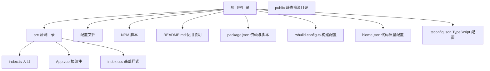
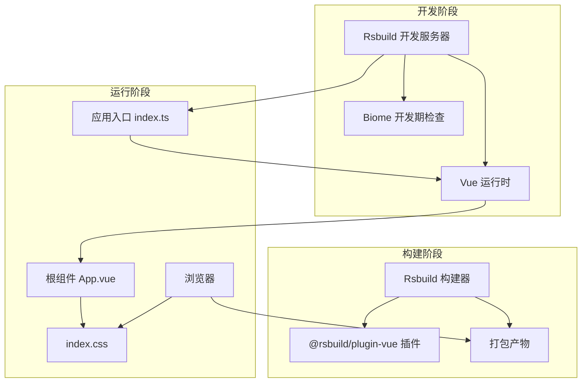
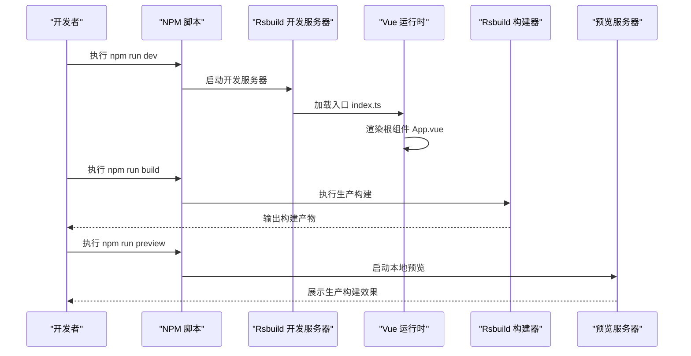
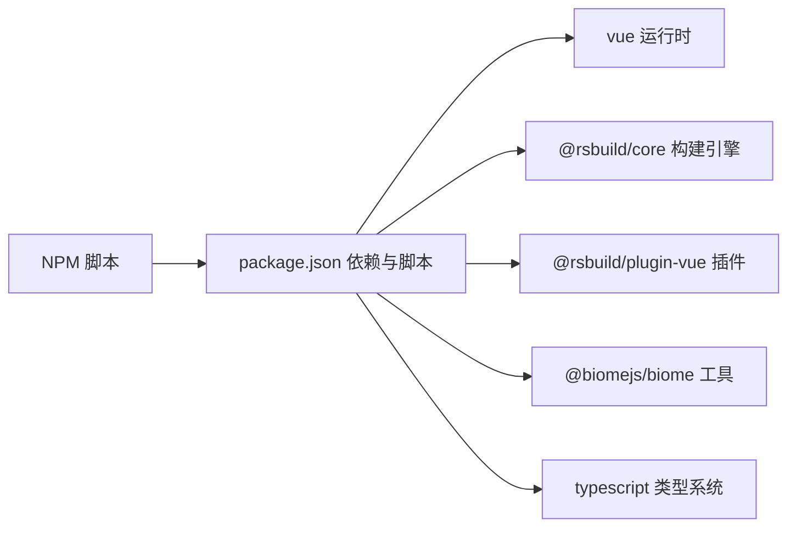
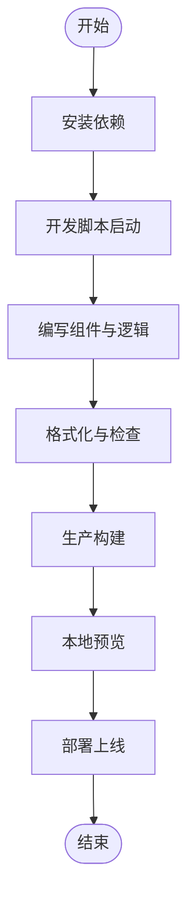

# 项目概述

<cite>
**本文引用的文件**
- [README.md](file://README.md)
- [package.json](file://package.json)
- [rsbuild.config.ts](file://rsbuild.config.ts)
- [biome.json](file://biome.json)
- [tsconfig.json](file://tsconfig.json)
- [src/index.ts](file://src/index.ts)
- [src/App.vue](file://src/App.vue)
- [src/index.css](file://src/index.css)
</cite>

## 目录
1. [简介](#简介)
2. [项目结构](#项目结构)
3. [核心组件](#核心组件)
4. [架构总览](#架构总览)
5. [详细组件分析](#详细组件分析)
6. [依赖关系分析](#依赖关系分析)
7. [性能考虑](#性能考虑)
8. [故障排查指南](#故障排查指南)
9. [结论](#结论)
10. [附录](#附录)

## 简介
本项目是一个基于 Vue 3 和 Rsbuild 的现代化前端单页应用（SPA）模板，旨在为新项目提供“开箱即用”的开发体验。它通过集成 TypeScript、Rsbuild 构建系统以及 Biome 代码质量工具，形成一套快速开发、可维护且现代化的技术栈组合。项目的核心价值在于：
- 快速开发：提供最小可行的 SPA 结构与一键启动脚本，降低上手成本。
- 开箱即用：内置构建与格式化检查配置，减少重复设置。
- 现代化技术栈：Vue 3 组件化、Rsbuild 高效打包、Biome 统一风格与规则。

该模板适合初学者快速搭建原型或学习现代前端工程化实践，也适合有经验的开发者直接在此基础上扩展业务模块。

## 项目结构
项目采用典型的前端模板布局，核心目录与文件如下：
- 根目录包含构建配置、包管理与质量工具配置文件。
- 源码位于 src 目录，包含入口脚本、根组件与基础样式。
- README.md 提供安装与运行说明。

图表来源
- [README.md](file://README.md#L1-L37)
- [package.json](file://package.json#L1-L26)
- [rsbuild.config.ts](file://rsbuild.config.ts#L1-L8)
- [biome.json](file://biome.json#L1-L35)
- [tsconfig.json](file://tsconfig.json#L1-L27)
- [src/index.ts](file://src/index.ts#L1-L6)
- [src/App.vue](file://src/App.vue#L1-L29)
- [src/index.css](file://src/index.css#L1-L7)

章节来源
- [README.md](file://README.md#L1-L37)
- [package.json](file://package.json#L1-L26)

## 核心组件
- 应用入口（src/index.ts）
  - 使用 Vue 3 的 createApp 创建应用实例，并将根组件挂载到 DOM 容器中。
  - 同时引入全局样式，确保页面基础样式在应用启动时生效。
- 根组件（src/App.vue）
  - 提供最简 SPA 内容结构，包含标题与提示文本，配合样式实现居中展示。
- 样式（src/index.css）
  - 设置基础字体、颜色与背景，保证页面视觉一致性。

章节来源
- [src/index.ts](file://src/index.ts#L1-L6)
- [src/App.vue](file://src/App.vue#L1-L29)
- [src/index.css](file://src/index.css#L1-L7)

## 架构总览
该模板采用“入口脚本 -> 根组件 -> 构建系统 -> 生产产物”的线性架构。Rsbuild 作为构建引擎负责处理 Vue 单文件组件、TypeScript 编译与资源打包；Biome 在开发阶段提供格式化与静态检查；TypeScript 提供类型安全保障。

图表来源
- [rsbuild.config.ts](file://rsbuild.config.ts#L1-L8)
- [package.json](file://package.json#L1-L26)
- [src/index.ts](file://src/index.ts#L1-L6)
- [src/App.vue](file://src/App.vue#L1-L29)
- [src/index.css](file://src/index.css#L1-L7)

## 详细组件分析

### 构建配置（Rsbuild）
- 配置文件通过 defineConfig 导出默认配置，并启用 @rsbuild/plugin-vue 插件以支持 Vue SFC。
- 该插件负责解析 .vue 文件、编译模板与样式、注入运行时依赖等。
- 通过 package.json 中的 scripts，分别提供 dev、build、preview 三类命令，覆盖开发、构建与预览场景。

章节来源
- [rsbuild.config.ts](file://rsbuild.config.ts#L1-L8)
- [package.json](file://package.json#L1-L26)

### 代码质量（Biome）
- 配置启用 VCS 集成、格式化与 Lint 规则集，推荐规则已开启，便于团队协作保持一致风格。
- 提供格式化与检查脚本，可在提交前统一代码风格与修复可自动修复的问题。
- 与 Git 集成，遵循忽略文件策略，避免对无关文件进行扫描。

章节来源
- [biome.json](file://biome.json#L1-L35)
- [package.json](file://package.json#L1-L26)

### 类型安全（TypeScript）
- tsconfig.json 采用严格模式，启用未使用变量/参数检测，提升代码健壮性。
- 模块解析采用 bundler 模式，目标 ES2020，适配现代浏览器与构建工具链。
- JSX 保留策略与 jsxImportSource 指向 Vue，确保 TSX 与 Vue 组件协同工作。

章节来源
- [tsconfig.json](file://tsconfig.json#L1-L27)

### 应用生命周期（开发到生产）
以下序列图展示了从开发启动到生产构建的完整生命周期，映射到实际的配置与脚本。

图表来源
- [README.md](file://README.md#L1-L37)
- [package.json](file://package.json#L1-L26)
- [src/index.ts](file://src/index.ts#L1-L6)
- [src/App.vue](file://src/App.vue#L1-L29)

## 依赖关系分析
- 运行时依赖
  - vue：提供响应式与组件化能力，是 SPA 的核心运行时。
- 开发时依赖
  - @rsbuild/core：构建引擎，负责打包与开发服务器。
  - @rsbuild/plugin-vue：Vue 支持插件，解析与编译 .vue 文件。
  - @biomejs/biome：代码格式化与静态检查工具。
  - typescript：类型系统与编译支持。
- NPM 脚本
  - dev：启动开发服务器并自动打开浏览器。
  - build：执行生产构建。
  - preview：本地预览生产构建结果。
  - check/format：Biome 的检查与格式化任务。

图表来源
- [package.json](file://package.json#L1-L26)

章节来源
- [package.json](file://package.json#L1-L26)

## 性能考虑
- 构建性能
  - Rsbuild 作为现代化构建器，具备增量构建与模块联邦等特性，有助于缩短开发等待时间。
  - Vue 插件按需处理 SFC，减少不必要的编译开销。
- 代码质量
  - Biome 的格式化与 Lint 可在开发阶段尽早发现潜在问题，降低后期调试成本。
- 类型安全
  - 严格 tsconfig 选项可提前暴露类型错误，减少运行时风险。
- 资源体积
  - 生产构建会进行压缩与 Tree Shaking，建议后续根据业务拆分路由与组件，进一步优化首屏加载。

## 故障排查指南
- 启动失败
  - 确认 Node 版本满足要求（由 package.json 中的 Volta 字段指定），并重新安装依赖。
  - 若端口被占用，调整开发服务器端口或关闭占用进程。
- 构建报错
  - 检查 TypeScript 编译错误与 Biome Lint 报错，优先修复类型与风格问题。
  - 确认 Rsbuild 插件已正确启用，且 Vue SFC 语法符合规范。
- 样式异常
  - 检查 scoped 样式作用域与全局样式的优先级，避免选择器冲突。
- 预览不生效
  - 确认已先执行生产构建再运行预览命令。

章节来源
- [README.md](file://README.md#L1-L37)
- [package.json](file://package.json#L1-L26)
- [biome.json](file://biome.json#L1-L35)
- [tsconfig.json](file://tsconfig.json#L1-L27)

## 结论
本项目以“快速、稳定、现代化”为目标，通过 Vue 3、Rsbuild 与 Biome 的组合，为新项目提供了一个简洁而强大的起点。对于初学者，它降低了工程化门槛；对于高级开发者，它提供了可扩展的架构与完善的工具链。建议在此模板基础上逐步添加路由、状态管理与业务组件，以满足更复杂的业务需求。

## 附录
- 典型使用流程（概念示意）
  - 安装依赖后，执行开发脚本启动本地服务；
  - 在编辑器中编写 Vue 组件与 TypeScript 逻辑；
  - 使用 Biome 格式化与检查工具保持代码质量；
  - 构建生产包并在预览服务器验证；
  - 将产物部署至静态站点或托管平台。

